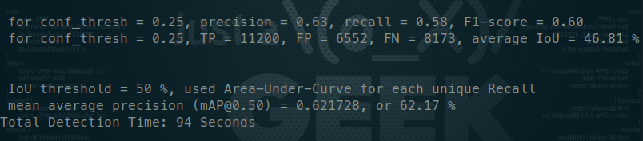

# <div align='center'>使用darknet训练YOLO实验记录</div>
#### <p align = "center">马玉峰📜</p>
-------------
2023.7.11更新
## 训练yolov3-tiny truck dataset

- 下载yolov3-tiny 预训练模型
- yolov3.weights转化为保留 15层卷积的yolov3.
```shell
./darknet partial ./cfg/yolov3-tiny-truck.cfg ./weights/yolov3-tiny.weights ./weights/yolov3-tiny.conv.15 15
```


-------------
2023.7.1
## 安装darknet

开启cuda、cudnn、opencv，make编译成功

## 推理测试

成功

## 训练YOLOv3 truck dataset

使用yolov3.cfg，更改batch、最后一层filters、classes数
建立truck.data，设置图片目录与label文件目录。

- 开始训练，在跑了5分钟左右失败，segmentation fault，直接断掉。
- 重新训练，在跑了10分钟左右失败，同样错误。
- 第三次训练，不到3分钟就失败，同样错误。
- 多次尝试，均在训练一会后失败。

## 使用voc实验
- 下载voc数据集，配置相关文件，准备训练。
- 使用voc训练，12小时没有出现问题。

## 使用pytorch版本YOLOv3

- 正常训练，无错误，结果良好

## 训练YOLOv5
- 正常训练，无错误。

## 排查问题

- 根据实验结果推测，大概率是数据集出现问题，但是使用yolov5可以正常训练，因为yolov5代码会将错误图片剔除，darknet中的C代码无具体bug信息，推测有以下可能性。
- 1) 数据集图片有问题。图片损坏、缺失、图片格式。
    2) 标签文件有问题。（标签中类别是否>=8，是否有 （0,0）类标签）

## 排查结果

- 为了排除图片存在格式问题，如二进制文件中的开头或结尾存在错误或丢失，将图片使用opencv遍历读取，又重新imwrite写回，这样可以保证图片格式正确。
- 读取标签文件，遍历找出 x y w h 不在（0,1）的，并更改赋值。
- 上述排查后，训练仍旧会断掉。继续排查

- 重新编译，禁用OPENCV，训练成功。Map@0.5 = 62.17%
- 推测是OPENCV版本差别导致的问题，原版darknet使用的是OpenCV2，本机使用的是OpenCV3。
```
# 训练
./darknet detector train cfg/truck.data cfg/yolov3-truck.cfg weights/darknet53.conv.74 
```

```
# 测试Map
./darknet detector map cfg/truck.data cfg/yolov3-truck.cfg backup/yolov3-truck_last.weights
```



