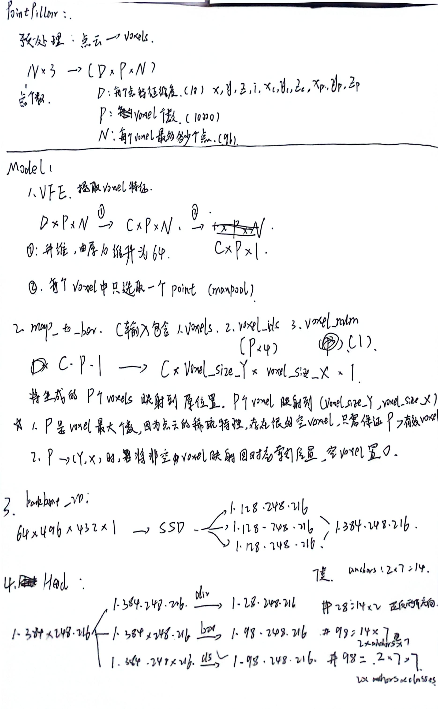

## pointpillar 详解

### 整体工作流

### 转化onnx模型流程

1. 预处理 point_clouds ---> voxels 
2. 模型推理
    1. 模型输入为voxels voxels_ids voxels_num
    2. map_to_bev, 将voxels映射到二维空间, 形成类图像数据, 这一步pointpillar_scatter操作使用CUDA重新编写, 形成新的TensorRT插件
    3. backbone, 卷积提取特征
    4. head, 预测头