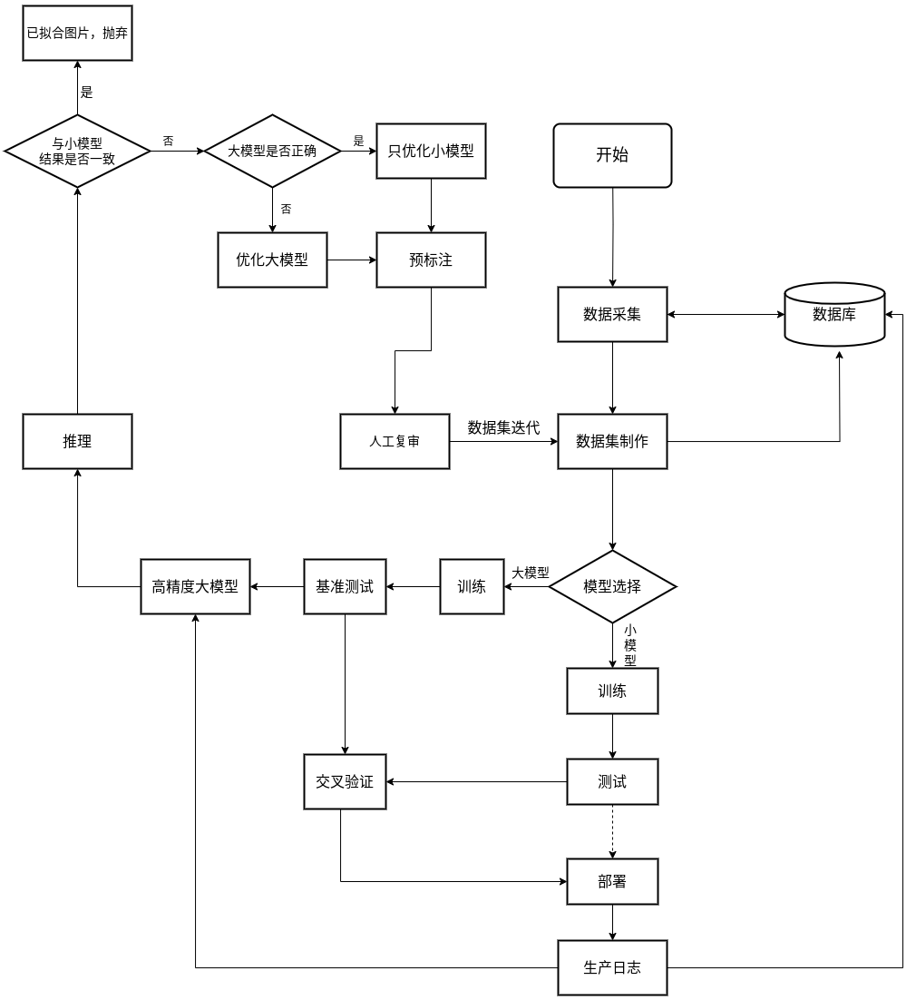

# 
 数据集更新与模型迭代 

#### 
马玉峰📜

## 模型
1) 建立双模型机制，小模型（部署模型）+ 大模型（指导模型）。
2) 小模型：部署模型，采用精简模型训练，如YOLOv5、YOLOv7n等，侧重于推理速度的提升，使用tensorrt加速后，在生产环境中运行的模型，生产运行中将检测结果上传到数据库中。
3) 大模型：指导模型，使用大模型训练，如YOLOV6-L6、YOLOX-L、InternImage-

## 迭代机制
1) 根据现有数据集和模型，训练一个效果优秀的大模型。
2) 将小模型部署在生产环境中。
3) 将生产日志中的生图与检测结果按需取出，使用大模型进行筛选，将有问题图片进行标注，放入训练集或测试集。
4) 根据筛选结果更新小模型或大模型。

- 系统流程图↑

