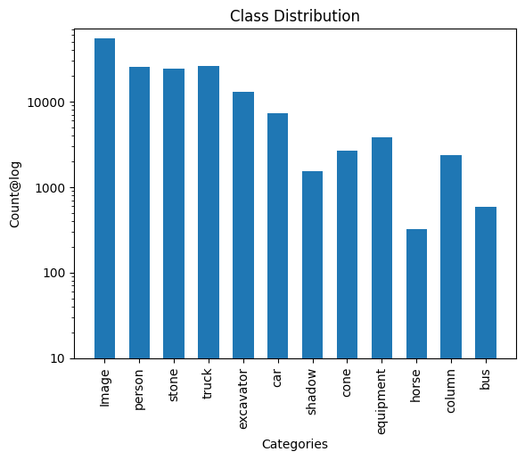
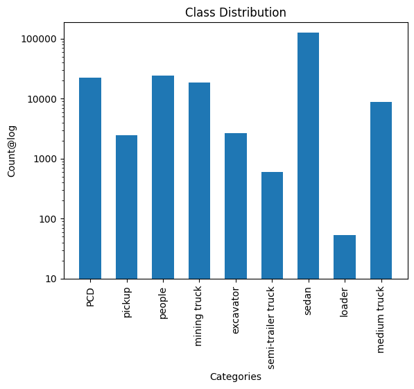
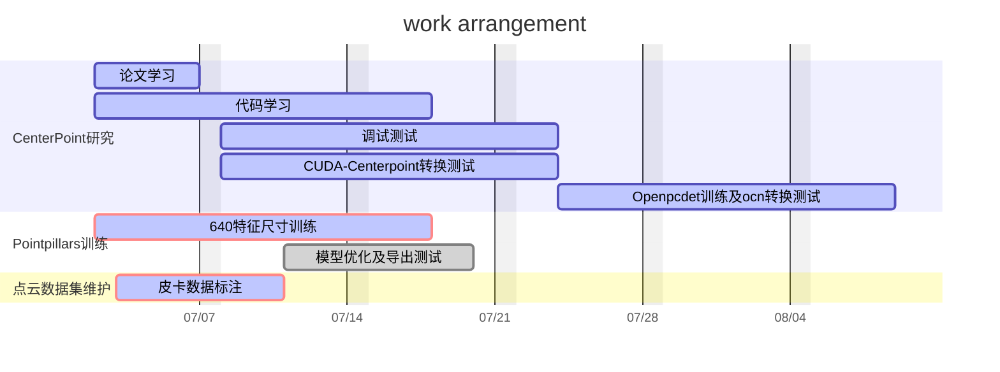

# 
 2024年7月工作计划 

  

  

#### 

---
## table of contents
- [数据集检查](#数据集检查)
    - [图像数据集统计](#一图像数据集统计)
    - [点云数据集统计](#二点云数据集统计)
- [工作计划](#工作计划)

## 数据集检查

#### 一.图像数据集统计
|class |num |# | 
| :----:| :----:| :----:|
|all_image |54943 | 

#### 二.点云数据集统计
|class |num |train |
| :----:| :----:| :----:|
|all_pcd | 22536 | |
|pickup | 2482 | |
|people | 24312| | 
|mining truck |18450 | | 
|excavator |2639 | | 
|semi-trailer truck |599 | | 
|sedan |126882 | | 
|loader |53 | | 
|medium truck |8885 | | 

|class |num |val |
| :----:| :----:| :----:|
|all_pcd | 1089 | |
|pickup | 143 | |
|people | 1284| | 
|mining truck |956 | | 
|excavator |133 | | 
|semi-trailer truck |43 | | 
|sedan |6331 | | 
|loader |0 | | 
|medium truck |459 | | 

## 工作计划

- 解决模型检测中的误检及漏检
    - 数据集方面，标注新数据，结合公开数据集
        - 标注0621录制的不同角度及上下坡时的皮卡数据2220帧，分发到4个人标注，共需约10天，目前已标注900帧。预计7.8完成
        - 将once数据集中的轿车、行人等类别加入数据集。其中包含对象 行人：7311、轿车：98140、卡车及巴士：7311，已完成转化，正在进行训练。预计需7.14日完成第一版模型训练。
    - 模型方面，pointpillars调参，新模型学习。
        - Centerpoint
            - 论文学习:Centerpoint。7.2 - 7.7
            - 代码学习:7.2-7.16
            - 调试Centerpoint官方代码、CUDA-Centerpoint代码:7.8-7.21
            - 使用自制数据集训练:8.1-8.14
            - 转化并测试自制数据集训练的模型:8.15-9.1
        - Pointpillars优化
            - 640尺度训练并测试:7.2-7.14
            - 模型优化及转化测试:7.15-7.22

- 具体计划如下

