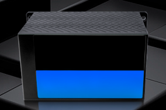
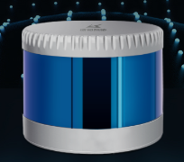
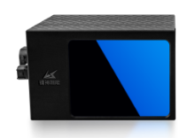
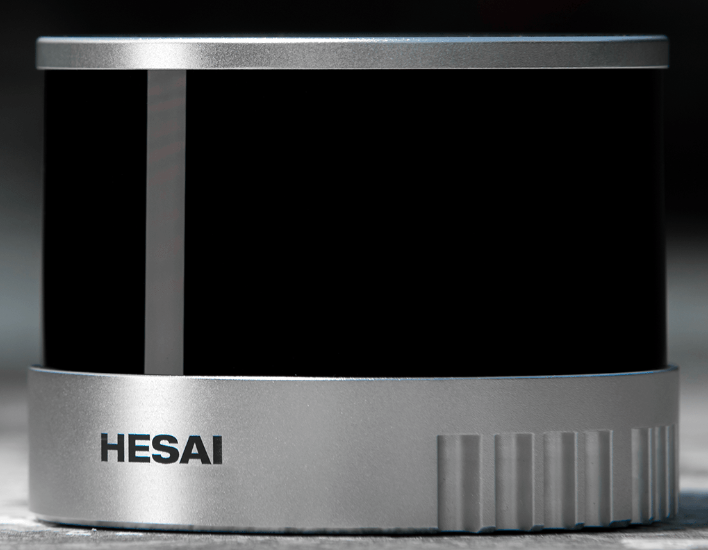
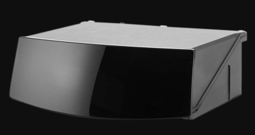
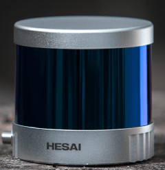
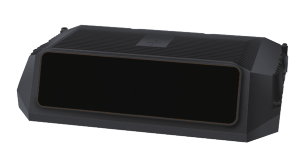
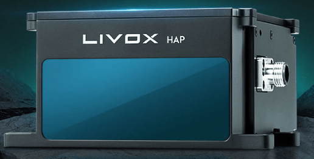

# 雷达选型总结
#### 
马玉峰📜

## 机械式激光雷达和固态激光雷达？

机械式激光雷达：采用机械旋转机构进行360度旋转。

- 优点：可视角广，精度高。
- 缺点：调试难、体积大、探测距离近、耐用性差（平均失效时间1000~3000小时）
- 价格和线束正相关，16线价格 1.4万-1.6万，32线2万以上

固态激光雷达：目前以半固态为主。
- 优点：体积小、性能稳定、探测距离远、耐用性强（可达车规级）
- 缺点：可视角相对小（120度）、市场普遍以高端产品为主（等效128线）、缺乏16线、32线等中低端产品。
- 16、32线固态激光雷达和机械式差别不大，等效128线激光雷达价格优势明显。

## 主视角雷达、补盲倒车雷达

主视雷达
- 安装在车前方
- 主要观测行驶中车辆前方信息
- 车辆行驶中路况复杂，对点云密度要求高
- 担任测距、检测、识别等任务。

补盲、倒车雷达
- 安装在车后方或侧方
- 倒车雷达主要是倒车时用来观测车辆后方信息
- 倒车时车速较低，障碍物单一，对点云密度要求低
- 主要承担测距、识别任务。

## 具体型号对比

### 

|雷达型号|品牌|类型|等效线束|测距|水平可视角|垂直可视角|有效数据点|可靠性|上市时间|价格|备注|图片|
| :----:| :----:| :----:| :----:|:----:|:----:| :----:| :----:| :----:| :----:| :----:|:----:|:----:|
| 镭神CH16 | 镭神 | 固态 | 16 | 200 | 120 | -4~2 | 213000 | 车规 |  #| 1.3W |#||
| 镭神CH32 | 镭神 | 固态 | 32 | 200 | 120 | -6.6~4.6 |426000 | 车规 | # | 2.1W |#||
| 镭神C16 | 镭神 | 机械式 | 16 | 200 | 360 | -15~15 | 320000 | 工规 | # | 1.2W |#||
| 镭神C32 | 镭神 | 机械式 | 32 | 200 | 360 | -15~15 | 600000 | 工规 | # | 2W |#||
| 镭神Ch128x1 | 镭神 | 固态 | 128 | 200 | 120 | 25 | 760000 | 车规 | 2022 | 3.5w |山推使用||
| XT16 | 禾赛 | 机械式 | 16 | 120 | 360 | -15~15 | 320000 | 工规 | # | 1.5w |#||
| XT32 | 禾赛 | 机械式 | 32 | 120 | 360 | -16~15 | 640000 | 工规 | # | 2.6w |#||
| AT128 | 禾赛 | 固态 | 128 | 200 | 120 | 25.4 | 1536000 | 车规 | 2021 | 3.8w |易控智驾、踏歌智行||
| QT64 | 禾赛 | 机械式 | 64 | 200 | 360 | -52~52 | 384000 | 工规 | # | 3.3w |#||
| QT128 | 禾赛 | 机械式 | 128 | 200 | 360 | -52~52 | 864000 | 工规 | # | 3.6w |#||
| Falcon | 图达通 | 固态 | 150 | 200 | 120 | 25 | 7385000 | 车规 | 2022 | 5w |性能优，蔚来||
| Hap | 览沃 | 固态 | 150m | 144 | 120 | 25 | 452000 | 车规 | 2022 | 7999 |非重复式扫描||

## 单线激光雷达

| 商家 | 型号 |测量方式|测量半径|价格|备注|
| :----| :----|:----|:----|:----|:----|
|镭神|M10|TOF|白色30米 黑色12米|1539|网口|
|思岚|A2M12|三角|12米|1469|无以太网接口，需额外模块|
|亚博|YDLIDAR 4ROS|TOF|30米|1721|无以太网接口|
|深圳晟光|C200|TOF|25米|1799|以太网接口|