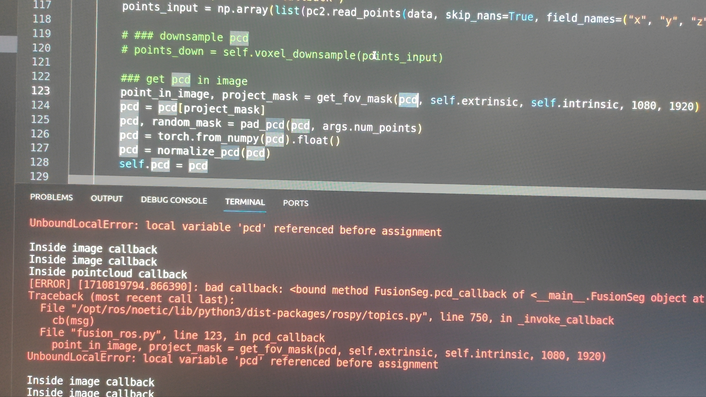
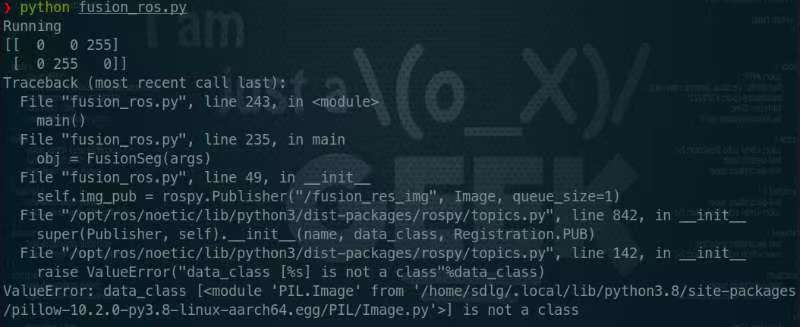
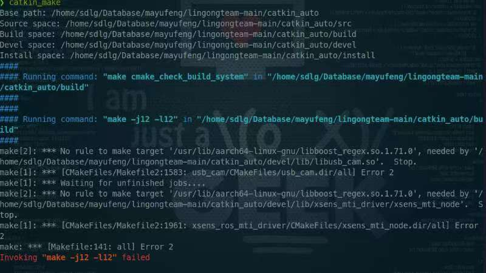
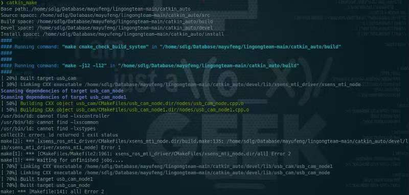
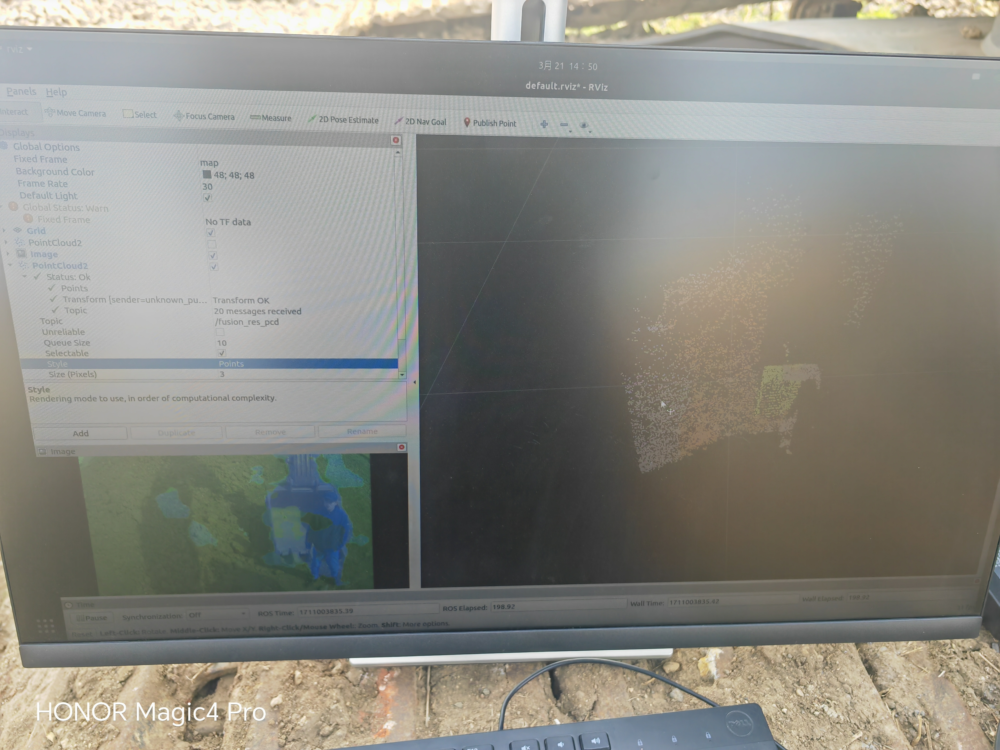
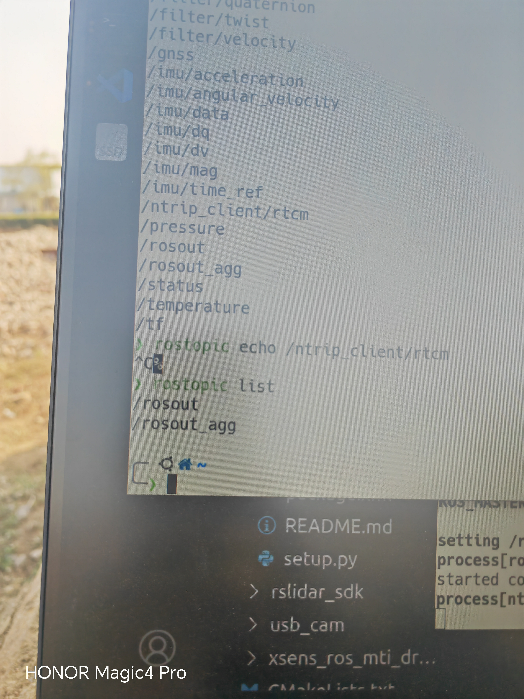
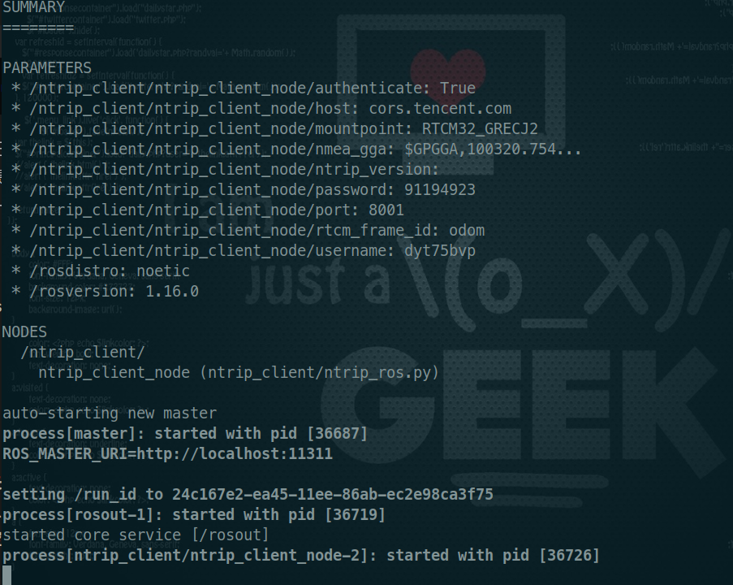
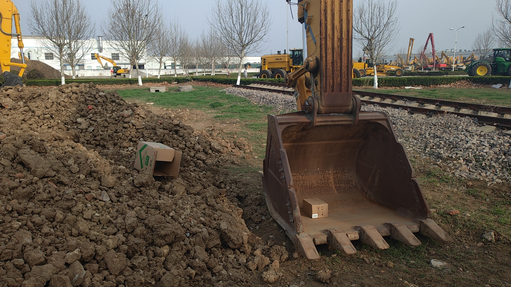

# <div align='center'> ⭐浙大代码调试⭐ </div>
  
<div align = "center">  </div>

#### <p align = "center"></p>

---

## table of contents

- [权重文件与网络结构不匹配](#权重文件与网络结构不匹配问题2024-02-27)
- [torch版本不匹配问题](#torch版本不匹配问题2024-02-28)
- [可视化问题](#可视化问题2024-02-28)
- [Orin安装PointNet](#orin上安装pointnet)
- [ROS代码调试](#ros代码调试)
- [雷达imu驱动安装问题](#雷达和imu驱动安装问题)
- [rtkimu测试](#rtkimu测试)
- [雷达摄像头测试](#雷达摄像头测试)
- [分割测试(03-21)](#分割测试2024-03-21)
- [分割测试(03-22)](#分割测试2024-03-22)

## 具体错误整理
#### 权重文件与网络结构不匹配问题(2024-02-27)
  
```bash
Traceback (most recent call last):
  File "train_2.py", line 306, in <module>
    main(args)
  File "train_2.py", line 203, in main
    model_without_ddp.load_state_dict(checkpoint["model"])
  File "/media/sdlg/DataSet/local/envs/lgzd/lib/python3.8/site-packages/torch/nn/modules/module.py", line 1051, in load_state_dict
    raise RuntimeError('Error(s) in loading state_dict for {}:\n\t{}'.format(
RuntimeError: Error(s) in loading state_dict for DeepFusionSeg_2stream:
        Missing key(s) in state_dict: "img_encoder.layer5.weight", "img_encoder.layer5.bias". 
        size mismatch for sa_module3.mlps.0.layer2.conv.weight: copying a param with shape torch.Size([512, 256, 1, 1]) from checkpoint, the shape in current model is torch.Size([1024, 256, 1, 1]).
        size mismatch for sa_module3.mlps.0.layer2.bn.bn.weight: copying a param with shape torch.Size([512]) from checkpoint, the shape in current model is torch.Size([1024]).
        size mismatch for sa_module3.mlps.0.layer2.bn.bn.bias: copying a param with shape torch.Size([512]) from checkpoint, the shape in current model is torch.Size([1024]).
        size mismatch for sa_module3.mlps.0.layer2.bn.bn.running_mean: copying a param with shape torch.Size([512]) from checkpoint, the shape in current model is torch.Size([1024]).
        size mismatch for sa_module3.mlps.0.layer2.bn.bn.running_var: copying a param with shape torch.Size([512]) from checkpoint, the shape in current model is torch.Size([1024]).
        size mismatch for fp_module3.mlp.layer0.conv.weight: copying a param with shape torch.Size([256, 768, 1, 1]) from checkpoint, the shape in current model is torch.Size([256, 1280, 1, 1]).

```

解决：更换模型

#### torch版本不匹配问题(2024-02-28)

```bash
❯ python train_2.py --output_dir ./output --resume ./weights/checkpoint.pth
Namespace(batch_size=16, create_pkl=False, data_aug=True, data_mode='light_dark', data_path='./', depth=6, device=0, dim=1024, dim_head=128, emb_relu=False, epochs=201, heads=8, img_backbone='resnet34', img_res=224, inputs='lidar,image', loss_weight='1,1', lr=0.0001, lr_gamma=0.1, lr_milestones=[100, 200], lr_warmup_epochs=10, mlp_dim=2048, model='DeepFusionSeg_2stream', momentum=0.9, num_points=8192, output_dim=6, output_dir='./output', print_freq=100, resume='./weights/checkpoint.pth', seed=35, start_epoch=0, train=False, use_pkl=False, visual=False, weight_decay=0.0001, workers=4)
torch version:  1.7.1
torchvision version:  0.8.2
/media/sdlg/DataSet/local/envs/lgzd/lib/python3.8/site-packages/torch/cuda/__init__.py:104: UserWarning: 
NVIDIA GeForce RTX 3090 with CUDA capability sm_86 is not compatible with the current PyTorch installation.
The current PyTorch install supports CUDA capabilities sm_37 sm_50 sm_60 sm_70 sm_75.
If you want to use the NVIDIA GeForce RTX 3090 GPU with PyTorch, please check the instructions at https://pytorch.org/get-started/locally/

  warnings.warn(incompatible_device_warn.format(device_name, capability, " ".join(arch_list), device_name))
Data path:  ['./seq_29', './seq_30']
Creating data loaders
Creating model
Start testing
Traceback (most recent call last):
  File "train_2.py", line 306, in <module>
    main(args)
  File "train_2.py", line 244, in main
    evaluate(args, model, data_loader_test, device, save_path)
  File "train_2.py", line 93, in evaluate
    _, img_seg_pred, pcd_seg_logit = model(input)
  File "/media/sdlg/DataSet/local/envs/lgzd/lib/python3.8/site-packages/torch/nn/modules/module.py", line 727, in _call_impl
    result = self.forward(*input, **kwargs)
  File "/media/sdlg/DataSet/Downloads/lg_code/nn/fusion_model/modules/deepfusion_test.py", line 155, in forward
    img_local_feat, img_feature = self.process_image(data_dict['image'], pos_emb=0)
  File "/media/sdlg/DataSet/Downloads/lg_code/nn/fusion_model/modules/deepfusion_test.py", line 120, in process_image
    img_feature = self.img_encoder(images)
  File "/media/sdlg/DataSet/local/envs/lgzd/lib/python3.8/site-packages/torch/nn/modules/module.py", line 727, in _call_impl
    result = self.forward(*input, **kwargs)
  File "/media/sdlg/DataSet/Downloads/lg_code/nn/fusion_model/modules/deepfusion_test.py", line 48, in forward
    conv1_out = self.relu(self.bn1(self.conv1(x)))
  File "/media/sdlg/DataSet/local/envs/lgzd/lib/python3.8/site-packages/torch/nn/modules/module.py", line 727, in _call_impl
    result = self.forward(*input, **kwargs)
  File "/media/sdlg/DataSet/local/envs/lgzd/lib/python3.8/site-packages/torch/nn/modules/activation.py", line 102, in forward
    return F.relu(input, inplace=self.inplace)
  File "/media/sdlg/DataSet/local/envs/lgzd/lib/python3.8/site-packages/torch/nn/functional.py", line 1134, in relu
    result = torch.relu_(input)
RuntimeError: CUDA error: no kernel image is available for execution on the device

```

  - 解决：首次尝试通过安装高版本torch1.10，但是torch1.10余pointnet不匹配。后续通过下载wheel包安装torch1.7.1，torchvision0.8.2，成功运行代码。

#### 可视化问题(2024-02-28)

  - 运行成功后只有准确率等输出，无可视化结果。

  - 2024-03-05 已解决

#### Orin上安装PointNet

[pointnet安装](https://github.com/erikwijmans/Pointnet2_PyTorch)

#### ROS代码调试

1. ROS安装，Orin空间不足。
删除autobeishan代码以及多余的库和缓存文件后使用鱼香ROS安装，失败。
官网安装ROS，多项依赖缺失，之前配置beisahn代码导致系统boost库、opencv等与noetic冲突，导致安装失败。重新安装解决。

2. ROS安装后配置雷达IMU驱动失败，之前的环境更改，导致需重新安装驱动。

3. fusion_ros 代码运行报错




调试已解决

#### 雷达和IMU驱动安装问题

1. libboost找不到



解决方法：设置软连接到系统存在的boost库可以解决。

2. ros包未配置

将src下的驱动包中的package.xml按照对应ros版本重命名。

3. opencv版本不匹配

ROS-noetic版本默认opencv3.2.0，驱动默认寻找opencv3.2.0。通过更改cmakelist指定opencv版本解决。

#### 分割测试(2024-03-21)

1. 速度较慢，约3秒钟一帧。

2. 地面分割不准确

    摄像头左侧地面是坡地，没有完整分割成不可同行区域。

3. 测试集结果 

|image average miou	|pcd average miou	|image average accuracy	|pcd average accuracy|
|---|---|---|---|
|0.9275720426959463|	0.8898443802017875	|0.963407501312297	|0.9501452525365844|



#### 雷达摄像头测试

1. 摄像头转接器接线断开，重新接线。

    - 已解决。
  
2. 雷达供电电池损坏，改用电源直连供电解决（不清楚是否安全）

3. 雷达接收不到消息

    - 更改本机IP解决
      - 本机IP 192.168.1.102
      - 雷达IP 192.168.1.200

#### RTK/IMU测试

1. 需配置地理信息和账户密码等
    
2. 设备使用需联网

3. 连接不稳定，断开程序后重连找不到设备，需多次插拔或重启。

4. 有positionlla消息，无RTCM消息，登录不上服务器

    
    
    
#### 分割测试(2024-03-22)

- 使用纸箱和石头模拟障碍物测试，效果如下
 


- 现场环境



