# 
⭐激光雷达测试

#### 
马玉峰、徐坤📜

----
## 测试前言

#### 测试人员：

- 马玉峰
- 徐坤

#### 测试场景

- 重机宿舍前停车场

#### 测试时间

- 2023.9.23 ~~ 2023.10.12

## 测试过程

### 录制数据

采用手持方式，举高约1.5米作用，在重机宿舍前停车场绕1米半径内录制点云数据包，格式为 ROGBAG.

### 运行点云检测算法

将rosbag转为pcd格式数据，使用基于华为once数据集训练的pointpillar_300模型测试目标检测效果。

## 测试效果

### 禾赛xt16

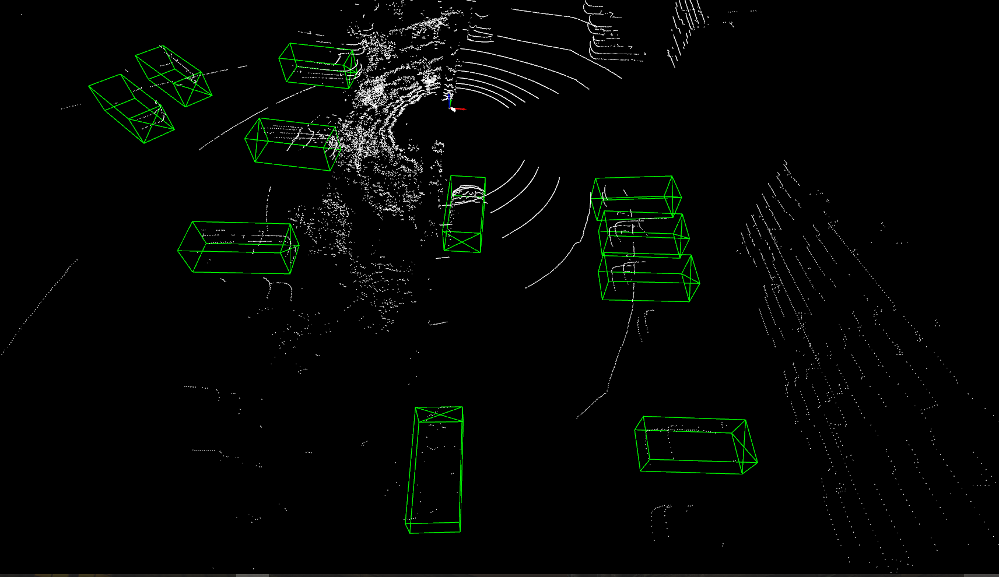
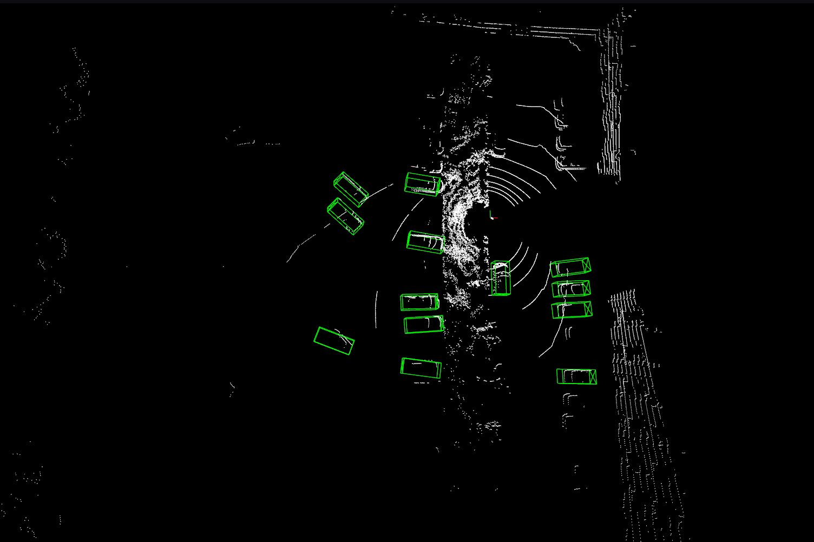
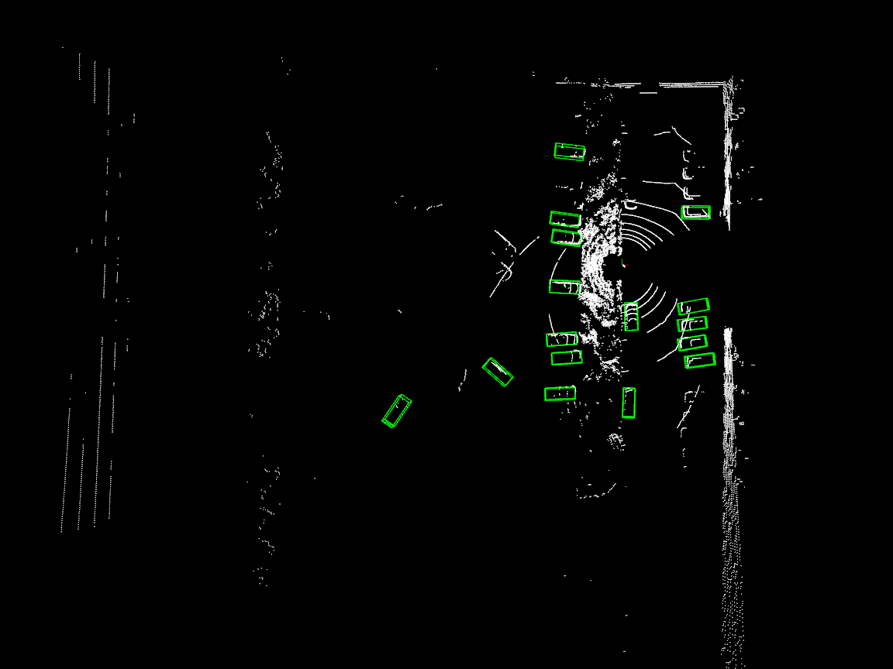

### 禾赛xt32
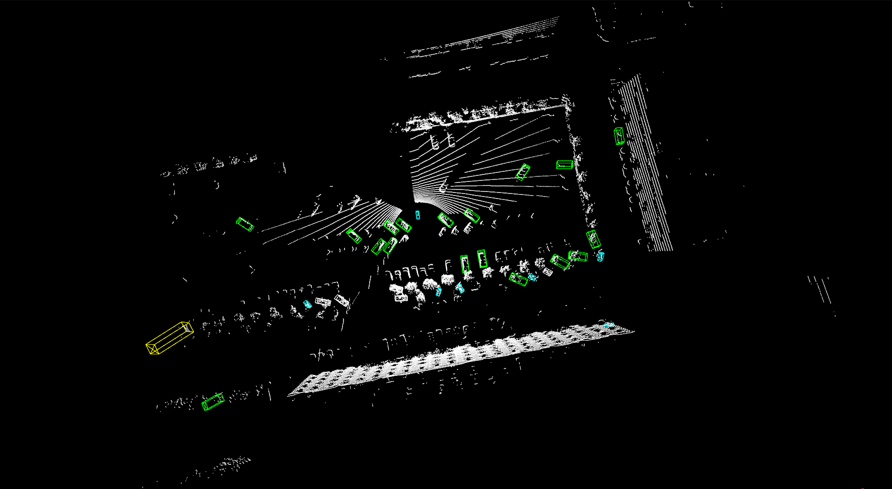
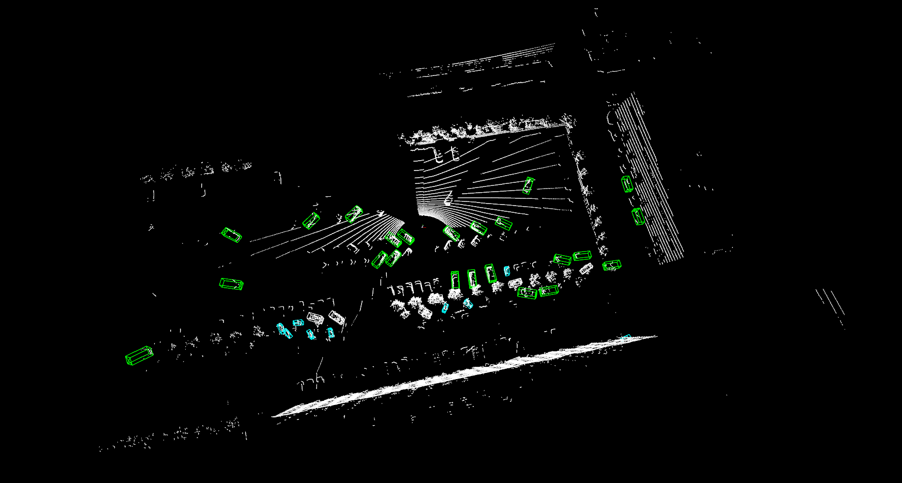
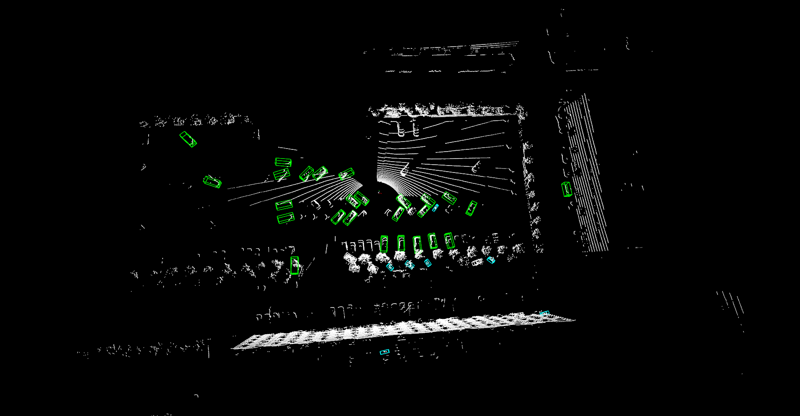
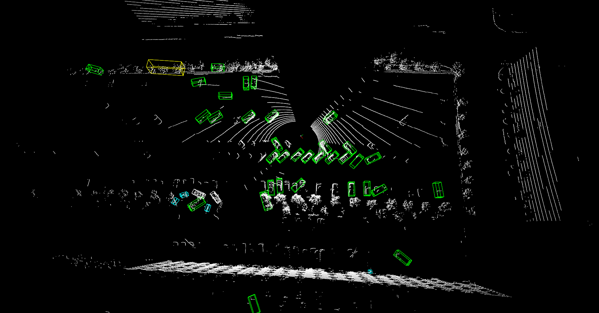
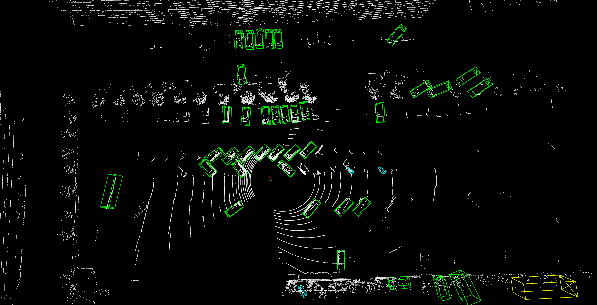

### 速腾32线

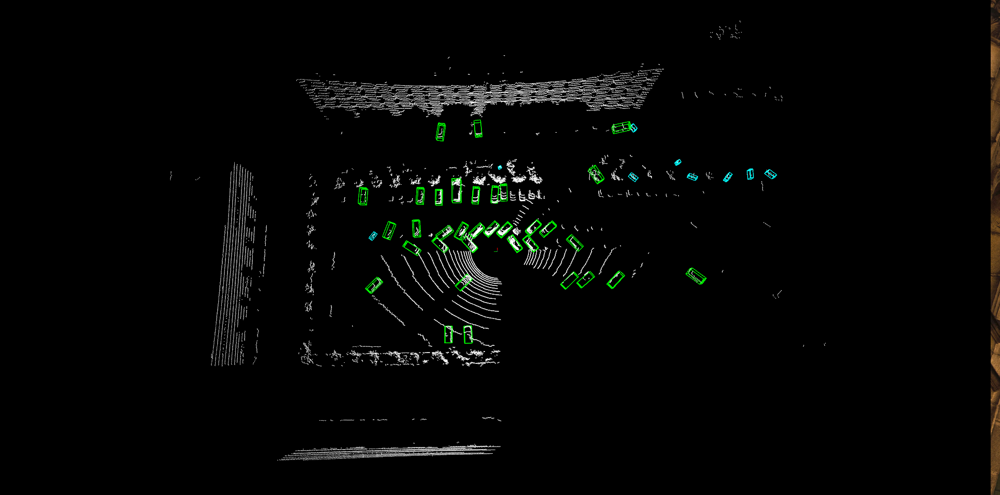
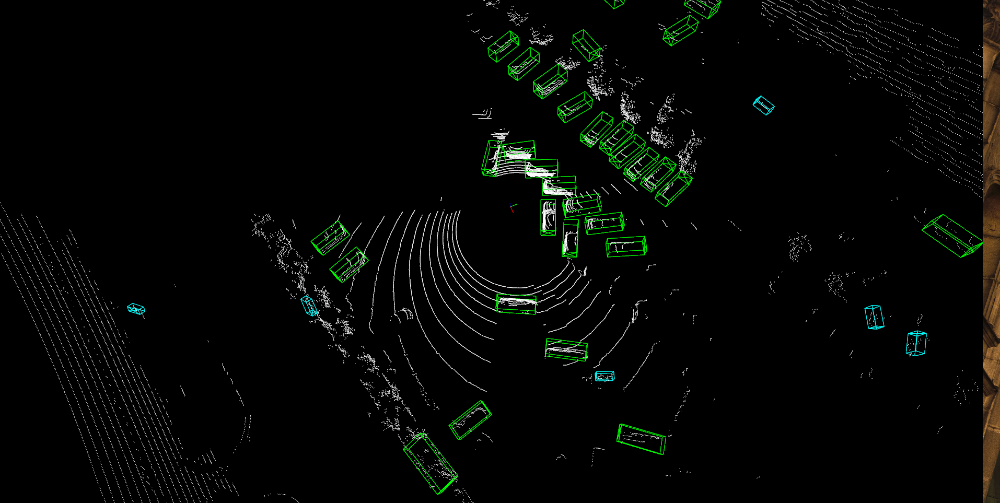
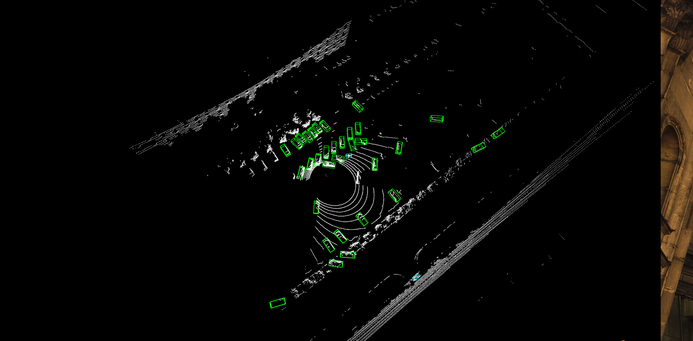
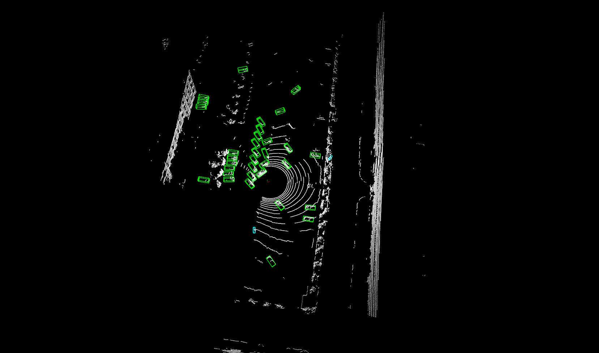

### 速腾M1

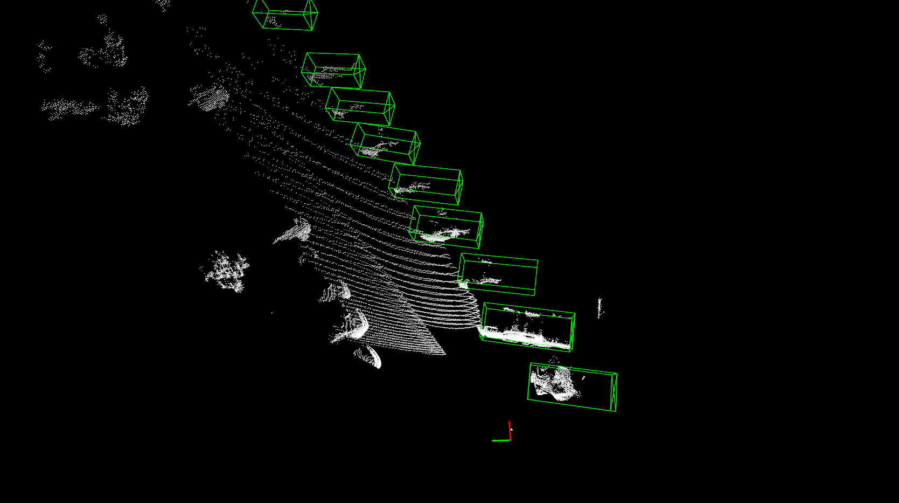
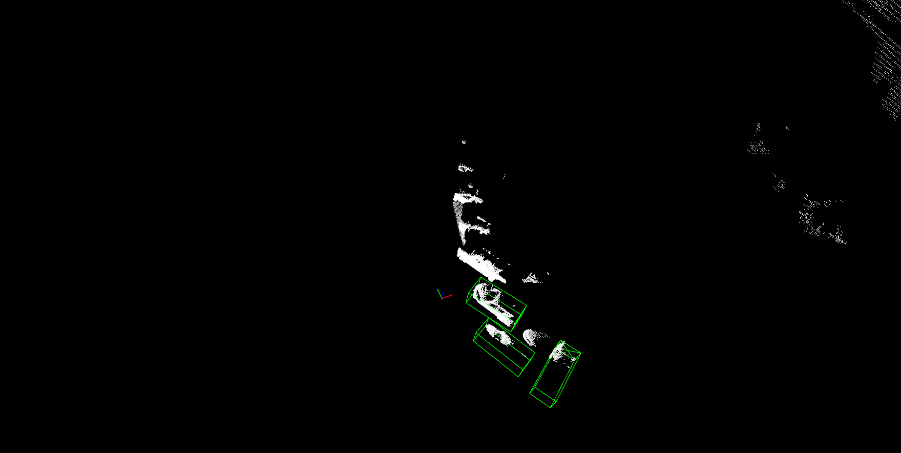
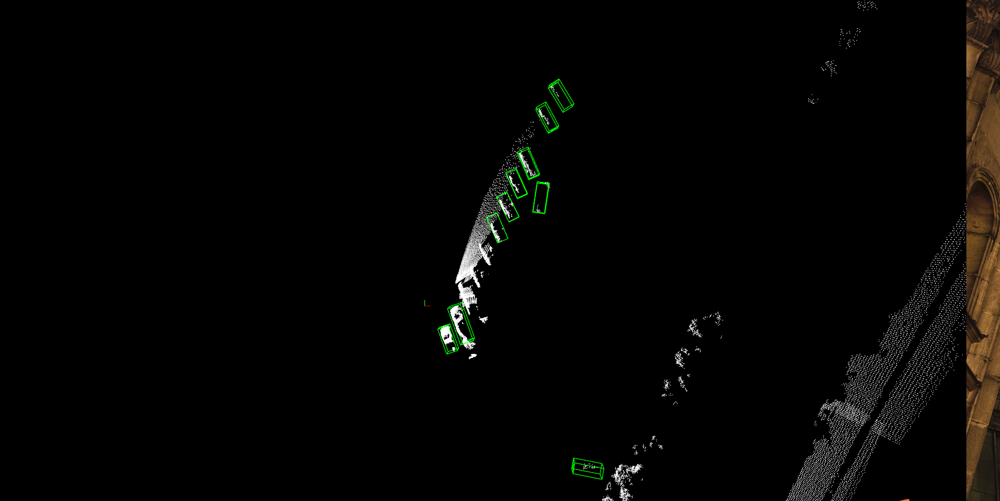
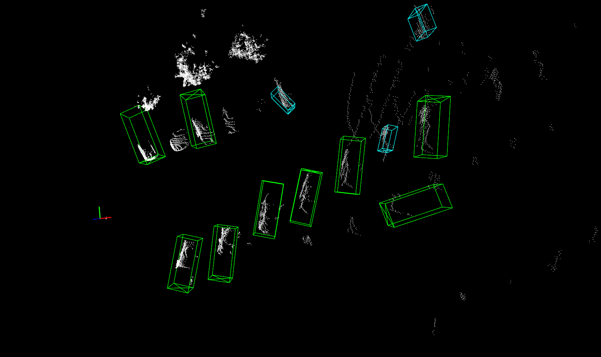
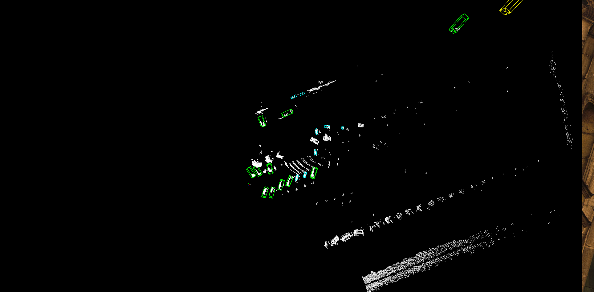

## 测试总结

- xt16线雷达线束稀疏，10米外基本检测不到。
- xt32、HS32 效果差不多，满足需求。
- M1检测距离远、精度高，满足需求。