# 
 ⭐点云NAN值影响测试⭐ 

  

#### 

---

## Table of Contents

- [Pth模型测试](#pth模型测试)
- [Onnx模型测试](#onnx模型推理)

## pth模型测试

#### 含NAN值

points number :(191646, 5)
[0.9474 ]
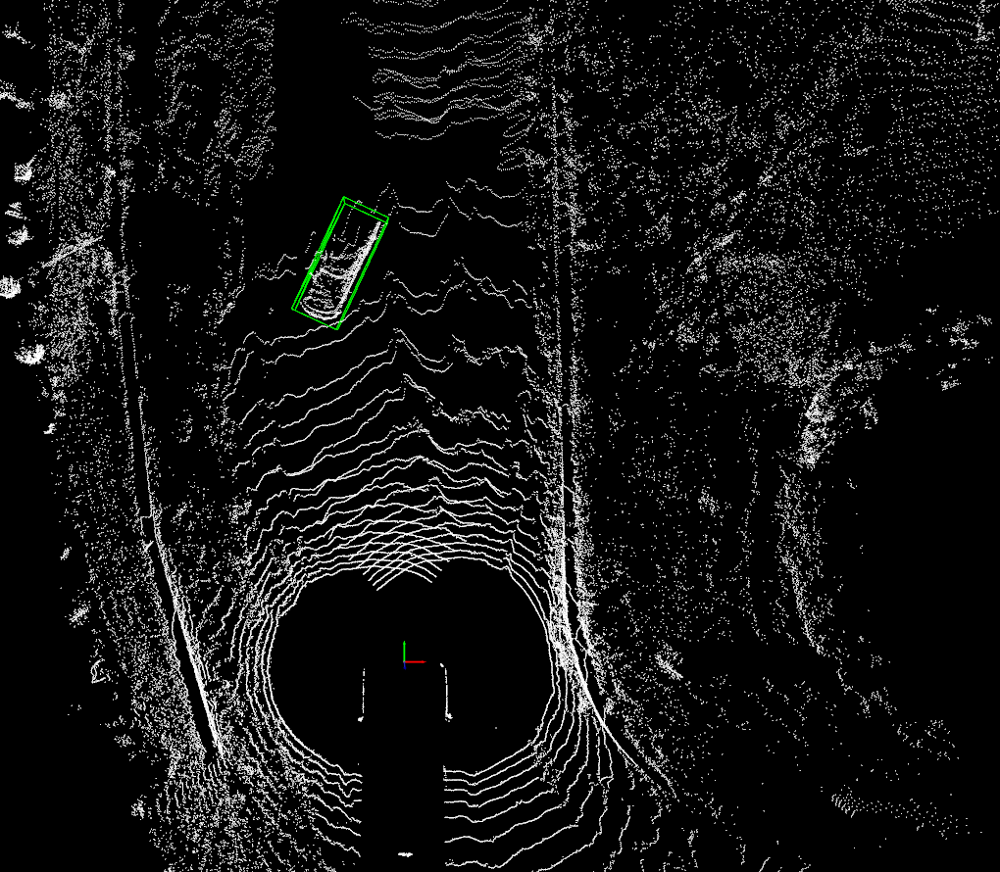

points number :(191646, 5)
[0.9599, 0.2307]
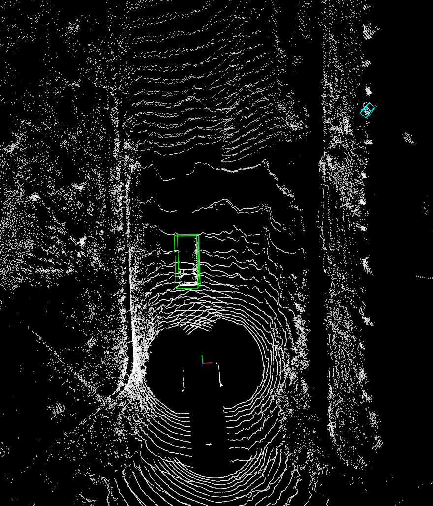

points number :(191646, 5)
[0.9540 ]
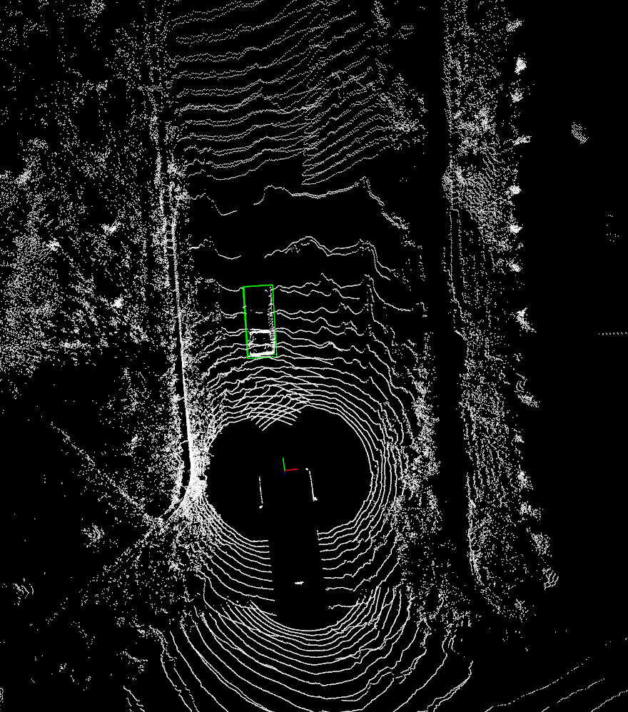

#### 去除NAN值

points number :(141392, 5)
[0.9474 ]
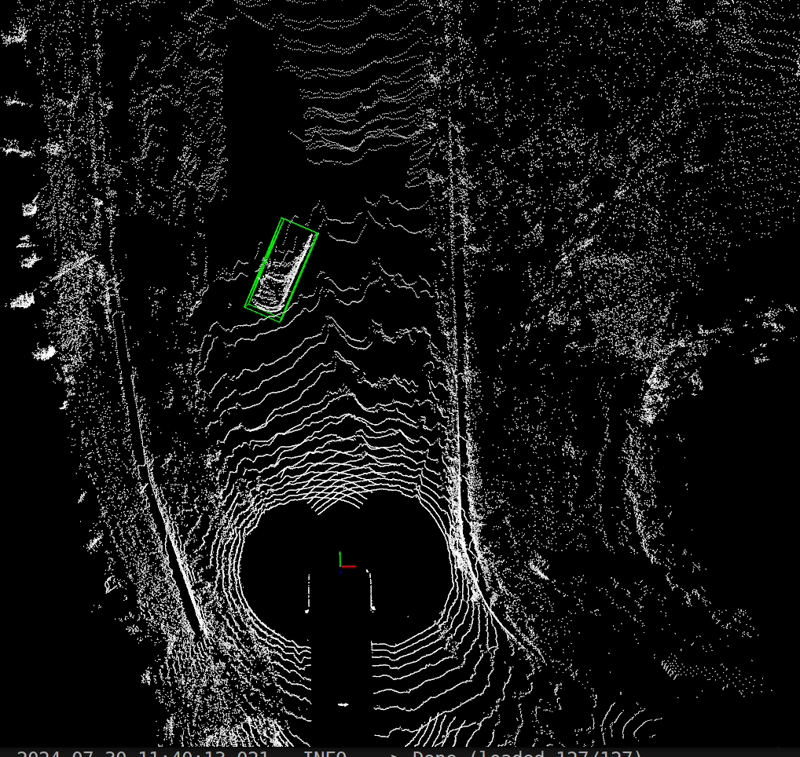

points number :(142259, 5)
[0.9599, 0.2307]
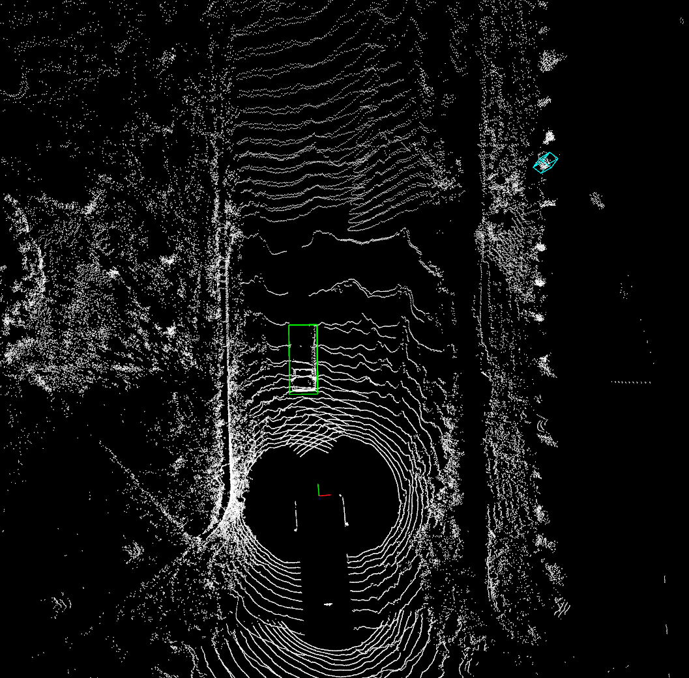

points number :(142283, 5)
[0.9540 ]
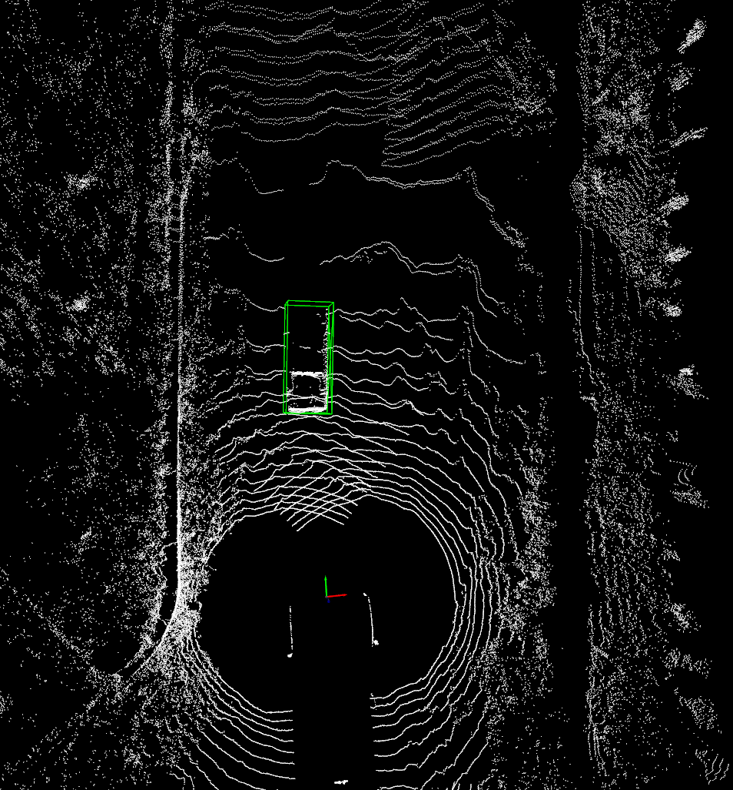

## onnx模型推理

#### 含NAN值

points num: 191646
[0.94728 ] 
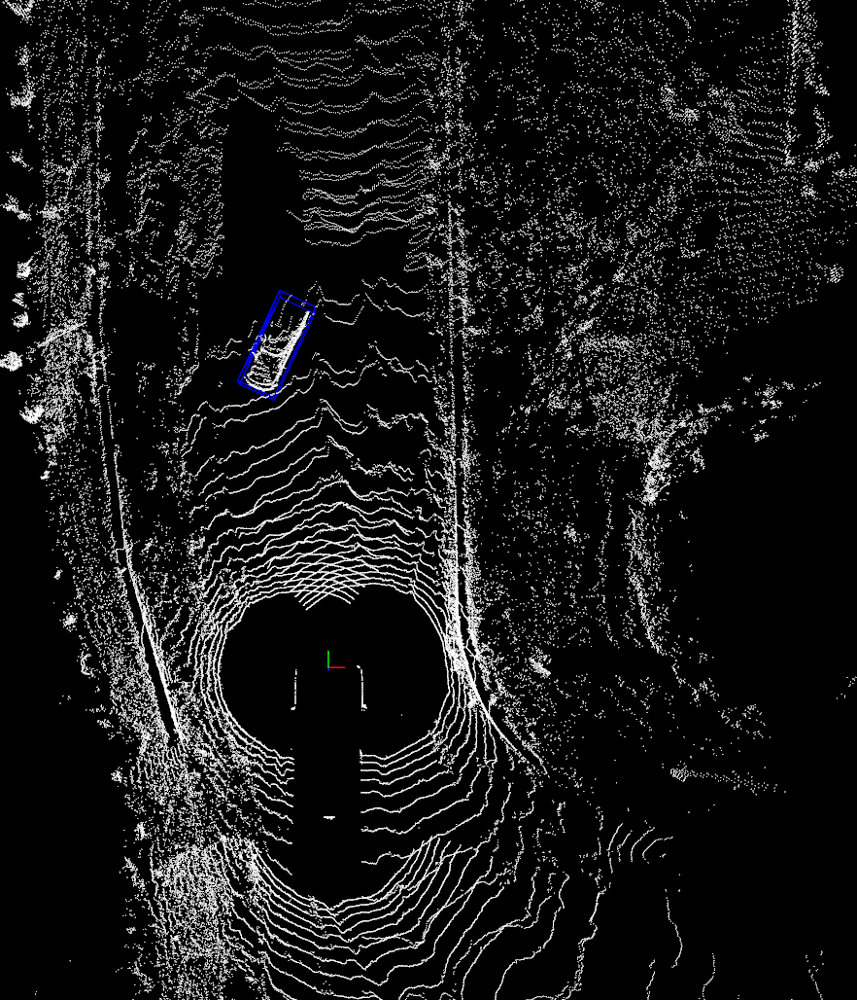

points num: 191646
[0.959781, 0.223741 ]
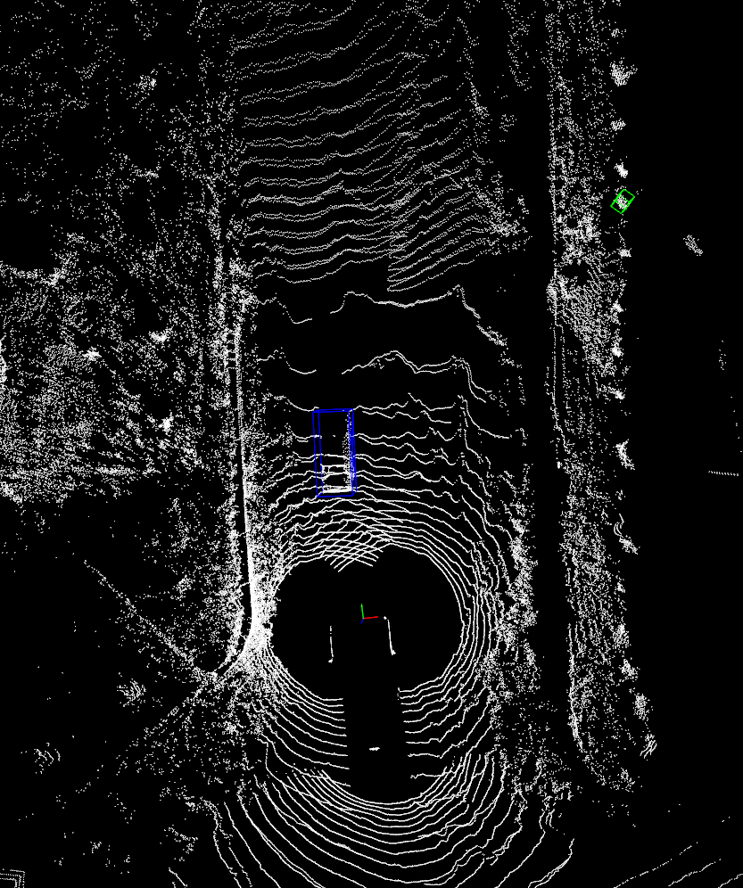

points num: 191646
[0.953865 ]
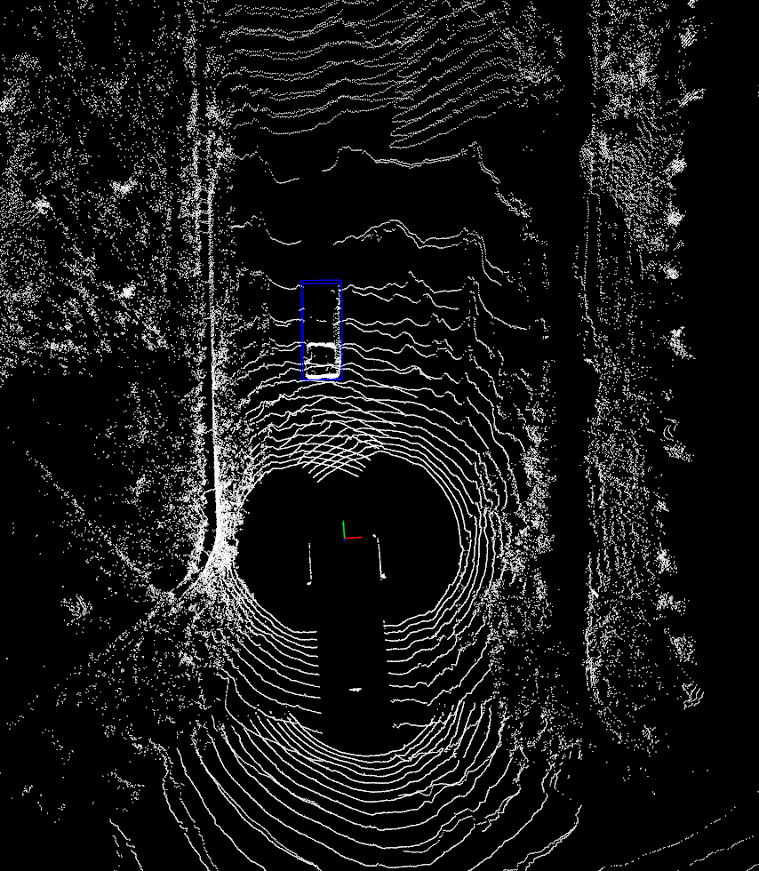

#### 去除NAN值

points num: 141392
[0.94728 ]
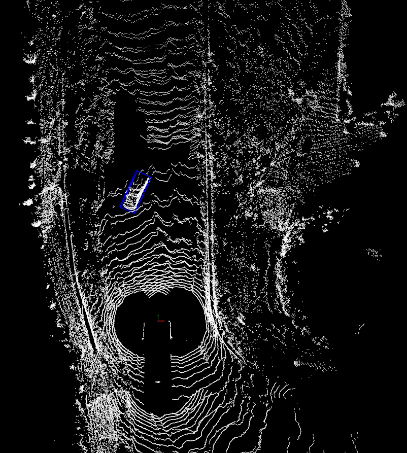

points num: 142259
[0.959779 ,0.22388 ]
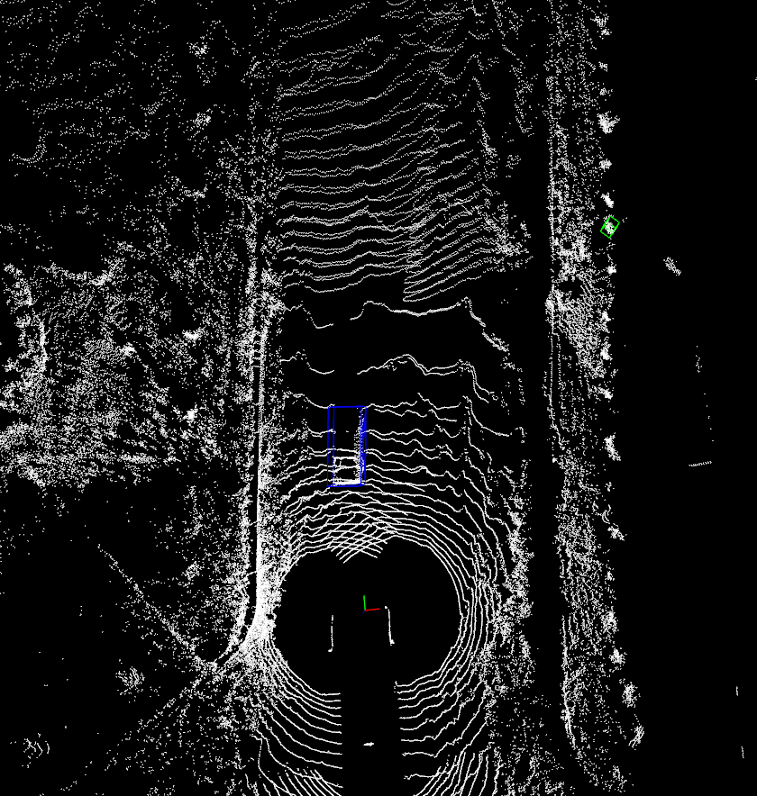

points num: 142283
[0.953866 ]
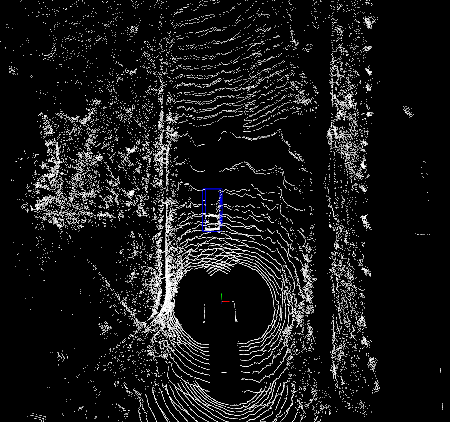
