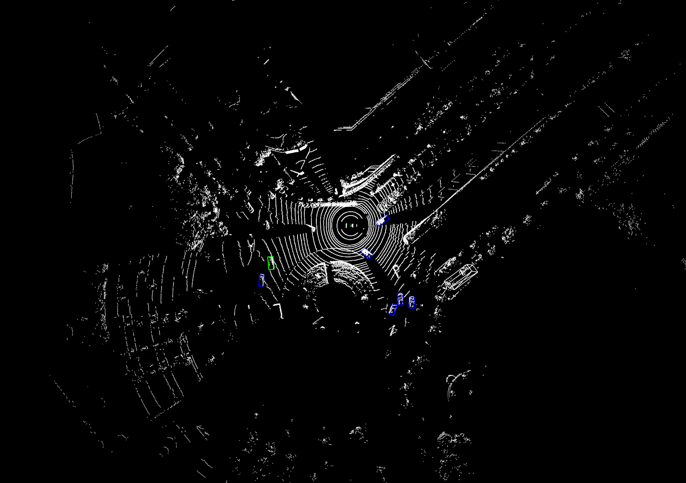

# 
 ⭐点云y轴旋转后检测测试⭐ 

  

#### 

---

##### 原始

##### 旋转1度

##### 旋转2度

##### 旋转3度

##### 旋转5度

##### 旋转10度

##### 旋转15度

##### 旋转20度

##### 旋转30度

##### 旋转-1度

##### 旋转-2度

##### 旋转-3度

##### 旋转-5度

##### 旋转-10度

##### 旋转-15度

##### 旋转-20度

##### 旋转-30度
