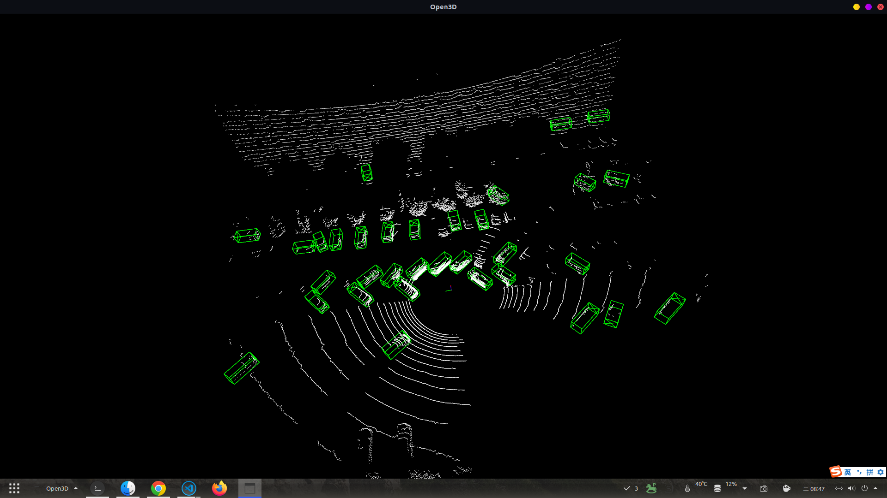

# <div align='center'> 点云目标检测使用记录 </div>

#### <p align = "center">马玉峰📜</p>

------

- [1. Q1:onnx模型相较于pth模型是否有精度损失？控制器环境与工作站环境不同对计算是否有影响？](#1-onnx模型相较于pth模型是否有精度损失？控制器环境与工作站环境不同对计算是否有影响？)
- [2. Q2:目前使用的检测模型是什么？](#q2-目前使用的检测模型是什么)
- [3. Q3:模型的泛化能力，模型在不同数据集上的检测效果？](#q3-模型的泛化能力模型在不同数据集上的检测效果)
- [4. Q4](#q4)

------

## Q1： onnx模型相较于pth模型是否有精度损失？控制器环境与工作站环境不同对计算是否有影响？

- 存在精度损失，但精度损失在一定程度上可以接受，因为精度损失主要是由于模型的复杂度和参数量的关系，而这些参数量和复杂度是可以接受的。
- 结论：pth版本和onnx版本误差在0.01~0.1，这是因为onnx模型使用了FP16模式，属于正常情况。orin和工作站误差在0.00001~0.001，对于实际场景来说误差可以忽略不计，从检测效果图上来说，没有区别。
- 环境：

工作站环境：3090、ubuntu18.04、cuda11.1、tensorRT 8.1
控制器环境：Orin、ubuntu20.04、cuda11.4、tensorRT 8.5

```python
pth(3090) = [5.4163e+00,  5.1904e+00, -1.3626e+00,  4.4574e+00,  1.7968e+00,1.3981e+00,  6.5581e+00,0.8585 ]
onnx(3090) = [5.54096, 5.18851, -1.3606, 4.46109, 1.79849, 1.39713, 6.55349, 0.859889 ]
onnx(orin) =[5.53738, 5.18578, -1.3596, 4.4594, 1.79843, 1.39719, 6.55631, 0.858244 ]

pth[3090] = [3.2762e+01,  1.8629e+01, -3.9376e+00,  4.6710e+00,  2.0242e+00,1.5939e+00,  3.4192e+00,0.8112]
onnx[3090] = [32.926, 18.6292, -3.9366, 4.66959, 2.0246, 1.59392, 3.41967, 0.811268 ]
onnx[orin] = [32.9269, 18.628, -3.9383, 4.67112, 2.02401, 1.5937, 3.41862, 0.810479 ]
```
sdlg_pth_lgmg.png↓

sdlg_onnx_lgmg.png↓

orin_onnx_lgmg.png↓


## Q2: 目前使用的检测模型是什么？

- 模型使用华为ONCE数据集，Pointpillar网络模型，训练300个epoch。
- 华为数据采集车传感器配置，从出点数推测似乎应该是Velodyne的128线激光雷达，采用三回波模式，从测距范围和精度看似乎是禾赛的Pandar 128线，其双回波是691万点。华为的ONCE是所有自动驾驶训练数据集中激光雷达点密度最高的。
- 华为数据集类别："car","bicycle","bus","tricycle","pedestrian","semitrailer","truck"
- 华为数据集Pointpillar训练，300epochs，结果如下：

|AP@50       |overall     |0-30m       |30-50m      |50m-inf     |
|:-------:|:-------:|:-------:|:-------:|:-------:|
|Vehicle     |72.88       |83.92       |66.56       |51.64       |
|Pedestrian  |20.64       |24.26       |16.22       |12.38       |
|Cyclist     |52.43       |63.25       |47.59       |31.60       |
|mAP         |48.65       |57.14       |43.46       |31.87       |

## Q3: 模型的泛化能力，模型在不同数据集上的检测效果？

- 使用华为ONCE数据集训练的pointpillar模型，once_300，在KITTI、重机、矿山上的检测效果如下：

KITTI↓


重机↓


矿山↓


ONCE↓


- 结果：在kitti数据集上，模型对于小汽车的检测效果较好，对于行人和卡车的检测效果较差。在重机数据上检测效果较好，因为其主要包含汽车类。在矿山数据上效果较差，对于矿车的识别不准，且检测框大小不匹配。

- 使用kitti数据集训练的pointpillar模型，在KITTI、重机、矿山上的检测效果如下：

KITTI↓


重机↓



矿山↓


ONCE↓


- 结果：在kitti数据集上，对于汽车和行人类检测效果较好，在重机数据上检测效果较好，在矿山数据上效果更差，对于矿车识别不到，在once数据上同样效果较差，大部分once中的类别如行人、自行车、卡车 都识别不到。

- 分析： 

    - 为何"矿车"的检测效果差？
        - once数据集中的类别为"car","bicycle","bus","tricycle","pedestrian","semitrailer","truck"，而kitti数据集中的类别为"car","pedestrian","cyclist"，而实际在矿山中需检测矿车并无训练数据，与其相近的为once数据集的"Truck"类，但是Pointpillar在检测上属于Anchor based算法，其训练时预设的anchor大小与矿车存在较大差异，因此无法检测到。

    - 为何"汽车"类的泛化性好？
        - 在once数据集与kitti数据集上都包含car类别，且其参数都近似，因此在检测汽车类时效果较好。
    
    - 为何"行人"类泛化性差？
        - 分析为once数据集与kitti数据集采集时的雷达高度不同，导致其行人类别的anchor_bottom_heights设置不同，kitti数据集设置为-0.6，once数据集设置为-1.62。

## Q4: 