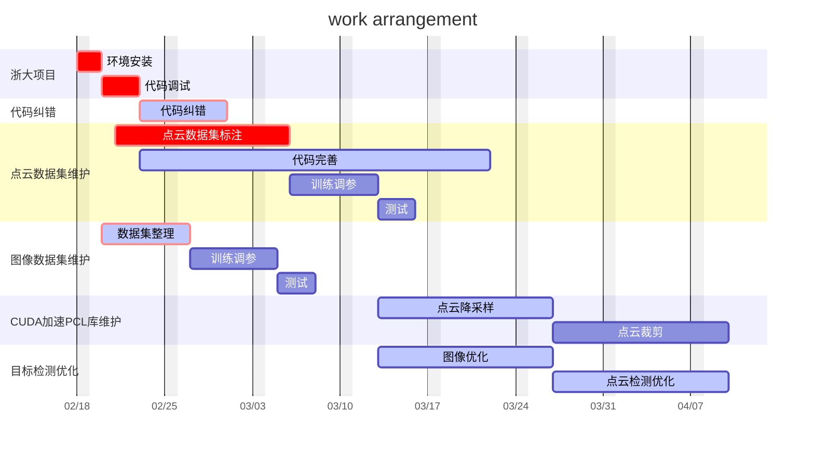

# 
 工作内容与计划书 

### 
 马玉峰 

#### 
 2024-02-17 

---

## 工作计划表

#### 甘特图

## 具体工作内容：

- 1、数据集维护
    - 数据集处理的相关代码 
        - ~~KITTI 评估代码~~
        - ~~Nuscenes 评估代码~~
        - ~~预处理录制点云并分发~~
        - ~~分割数据集~~
        - ~~处理标注后点云数据集并生成训练文件~~
        - ~~数据集检查（获取类别、标注数量、anchor-size）~~
        - ~~supervise可视化~~
        - 数据增强
        - 融合KITTI到CUSTOM数据集
        - 融合ONCE到CUSTOM数据集
    - 数据集分发、标注回收、整理训练
    - **后续将新标注的图片以及之前使用爬虫获取的4000余张图片整理后加入训练集，点云方面继续录制新的点云数据标注。**

- 2、CUDA加速PCL库维护
  
    - ~~pcl ‘+’~~
    - ~~pcl ‘transform’~~
    - 降采样
    - 裁剪
  
> 前期在进行多雷达点云的融合操作时，遇到了耗时较长的问题，前期研究后决定使用CUDA加速的方式解决速度问题，但是网上没有相关代码，只有一份没有开源代码的库，其使用不方便，且不支持自定义的点云数据格式。因此通过自己编写CUDA核函数和调用函数的方式解决了问题，将速度提升了10倍。
但是目前只完成了点云的加法和旋转操作，后续项目中还会用到点云的其他操作，因此需要继续将其他操作也使用CUDA进行加速，提高代码效率 。主要难点在于降采样，算法逻辑和代码编写都较难，且对CUDA编程不是很熟悉。 

- 3、目标检测算法优化
    - 图像
        - 目前效果最好的yolov5-lite-g,存在问题是相对于yolov8的anchor-free方式，对物体尺寸较敏感，容易对小尺寸对象产生误检、漏检。后续优化yolov8的 tensorRT部署。
    - 点云
        - 目前使用的pointpillar算法只使用了雷达信息，最新的BEV算法融合了雷达和摄像头的信息，待目前的点云算法稳定后研究BEV算法。
    

- 4、代码debug
    - 在点云融合后推理时会报错退出，目前已经过多次修复。主要难点在于无法定位问题原因，代码报错提示为 *点云的复制操作出错*，但是实际问题根源尚未查清，目前从现象上进行了多次修复后仍旧会在其他地方出错。后续继续测试并找出原因修复。

- 5、浙大项目运行
  - 环境配置。
    
    浙大的orin在前期工作中因为硬盘空间不足，删除了原有的数据和环境配置，只保留了系统。为了运行浙大的项目，需要根据项目的依赖重新进行环境配置。
  - 代码调试 
    项目需要首先使用数据集进行训练，然后进行测试。因此需要调试代码、训练模型、调参、测试等工作。
  
## 
数据集情况

#### 图像数据集

- person（行人）：54683
- stone（石头） ：23119
- truck（矿卡） ：21363
- excavator（挖掘机） ：5367
- car（汽车） ：14294
- shadow（阴影水坑） ：3340
- cone（路锥） ：6837
- equipment（其他工程机械：装载机、掘地机） ：4464
- horse（水马） ：655
- column（路柱） ：1982
- bus（洒水车、厢式货车） ：305
    ##### 下一步计划
    - 整理新标注的数据集，加入训练集。
    - 整理之前爬虫获取的数据集、筛选、标注。

#### 点云数据集

- mining truck（矿卡）：9102
- person（行人）：425
- car（汽车）：1136

    ##### 待标注数据
    - 矿车:3000 （已满足）
    - 皮卡:1000  （已满嘴）
    - 行人:3000  
    - 挖掘机:1500
    - 装载机:1500
    - 石头(直径>40cm):1000 （不能拿同一块石头录制数据）
    - 汽车:1500
    - 洒水车:1000
    - 社会车辆:1500

