# 
⭐标准文档

🚚🚂🚌🚗前言🚜🚧🚲👨‍🔧

AI任务的基石是数据集，数据集的基石是标准

基于深度学习的AI任务的基础是数据，可以说数据集的质量和数量在很大程度上决定了AI任务的上限。在图像分类领域，正是李飞飞创建的ImageNet数据集开启了视觉任务的深度学习时代，后续的COCO同样是目标检测领域持久的标杆。正是因为这些数据集在数据采集、清洗、标注上都建立了极为严格的标准，并且经过反复的审核，才能呈现极高的质量。

 

----
🚩

场景分析⛰🏜

工作场景为各类矿山。其中动态对象包括各类工程车辆（挖掘机、装载机、矿车）、普通车辆、工作人员。静态目标包括方锥、路面、建筑物、碎石等。工作时间包括白天和夜间、正常天气与雨雪雾等恶劣天气。

任务要求🎯🕹

此项目主要目标是为了辅助矿车进行无人驾驶，目前的检测目标为7类。涵盖了矿车行驶过程中需避让的主要对象。

- 行人
- 石块
- 矿车
- 挖掘机
- 汽车
- 方锥
- 其他工程机械

前期数据集还有“阴影”类，考虑到数据数量与质量，和类别定义的不准确性，以及对数据集类别平衡的影响，现去除"shadow"。

🏁

----

# 
具体标注说明📜

## 总体要求⚓

- 1、准确，标注框要贴紧对象边缘，标注框要包含对象的所有实体，图中未显示的对象实体不能靠想象补全，只标注出现的实体。
- 2、完整，图片中的所有符合要求的对象都需要标注，不能漏标。
- 3、标准，标注时要遵循统一的标准，切记前后标准不统一。标注时如有问题应反馈讨论，必要时完善标准。

## 行人🕴

行人类别，person，包括显露全身和部分身体的人物。室外室内以及车辆内的、近处远处、能分辨出人形的。

示例图

标注时应注意划清边缘，人物的身体部分要全部包含，但是人物身体之外的对象（包、自行车、手持物品等）无需包含。

## 石块💎

石块类别，stone，主要指独立、突出的石块，大小无论。道路中出现的石块一般都需标注，在乱石堆中的石块需要将其中明显独立石块标注。

原则上是道路及两侧出现的突兀石块必须标注，乱石堆中的石块尽量标注。

示例图

道路中出现的必须标注，其他地方（石头堆、矿渣、乱石地）处的石块多多益善，且以独立、突出的为主。

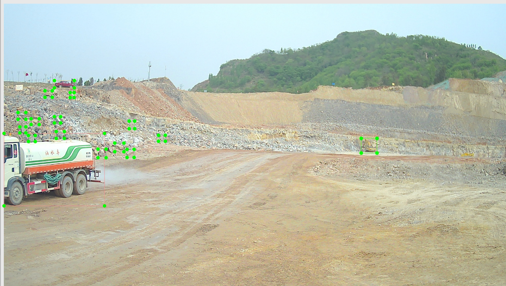

## 矿车🚜

矿车类别，truck.
包括矿卡、大翻斗、重卡等大型卡车，但是不包括厢式货车、面包车。

示例图

 
正确示例↓

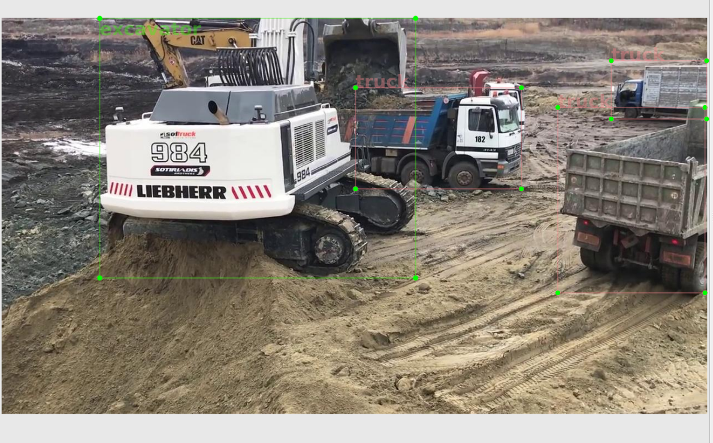
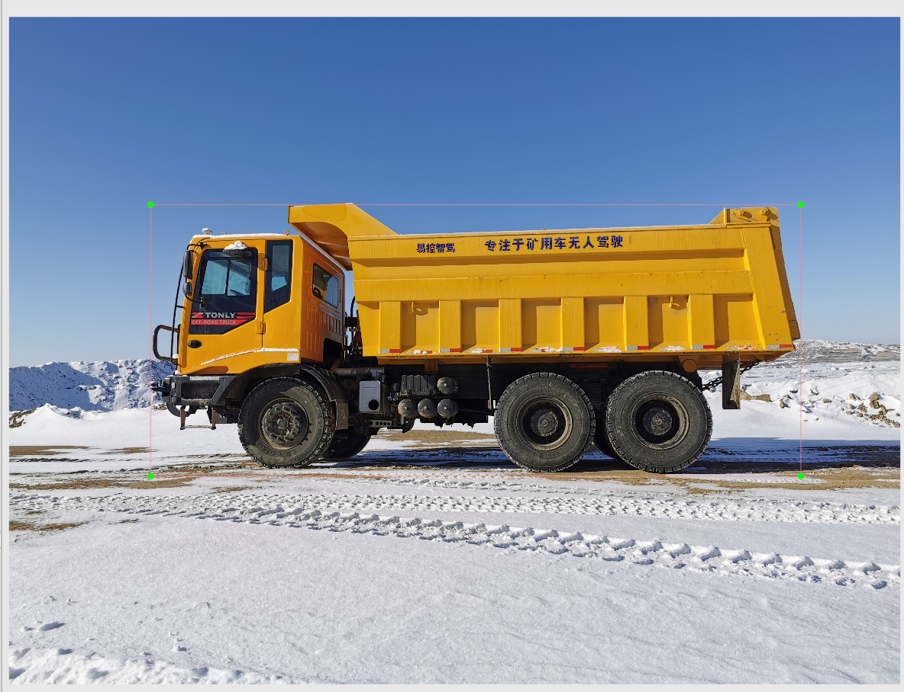

错误示例↓

## 挖掘机⛏

挖掘机类别，excavator。

标注时应将注意铲斗范围，将铲斗和车身都完全包含。

示例图

 
示例↓

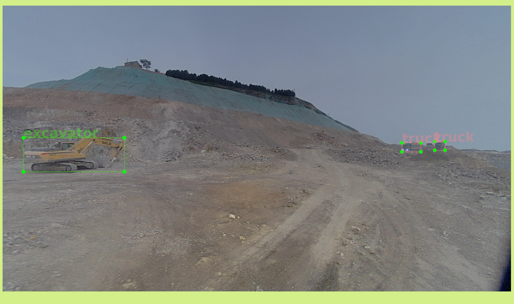

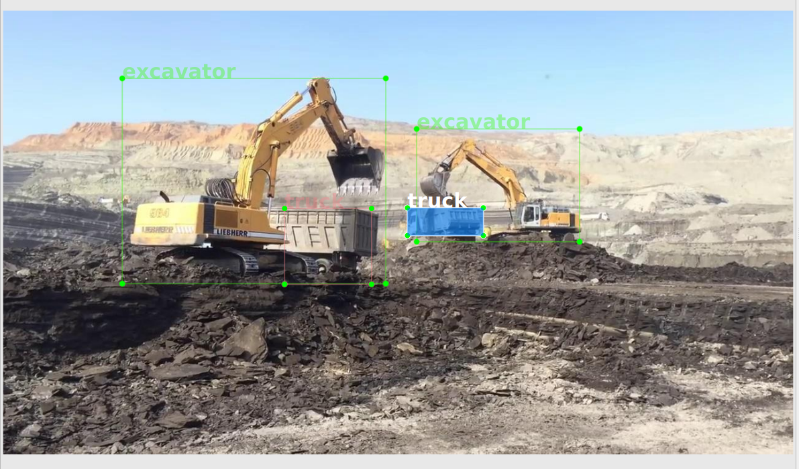

## 汽车

汽车类别，car。

常见两厢车、三厢车、suv、小型货车、皮卡、面包车、中型厢式货车等。

示例图

 
示例↓

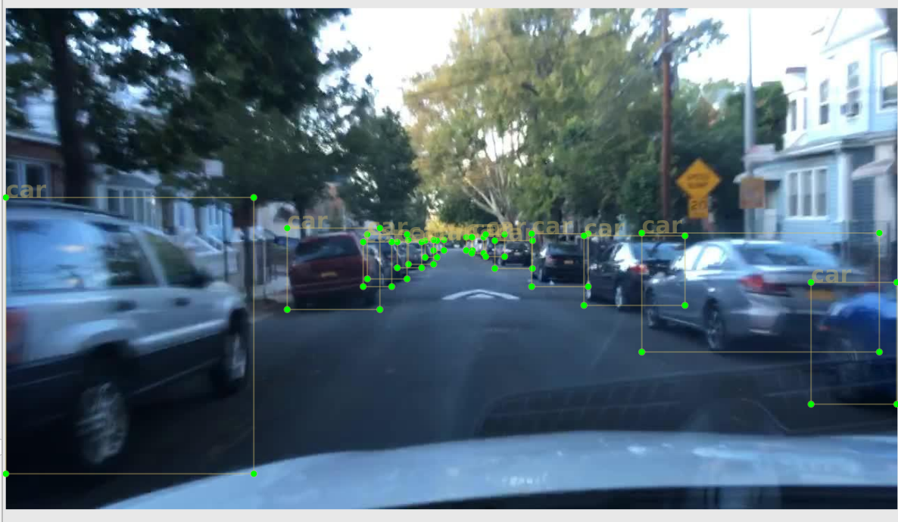
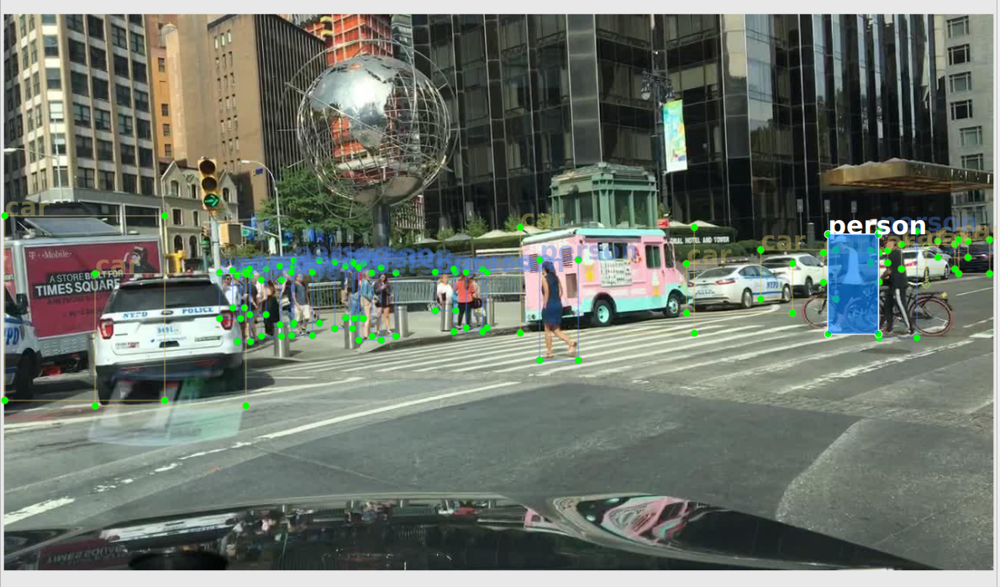
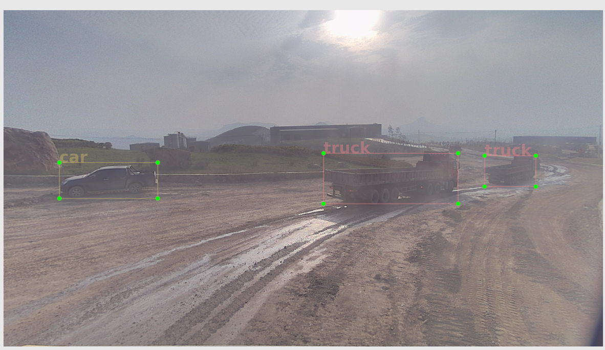

## 路锥🚧

cone。

包括方锥、三角锥、路障、反光圆筒等。一般带有明显条纹状、或反光带。

示例图

 
示例↓

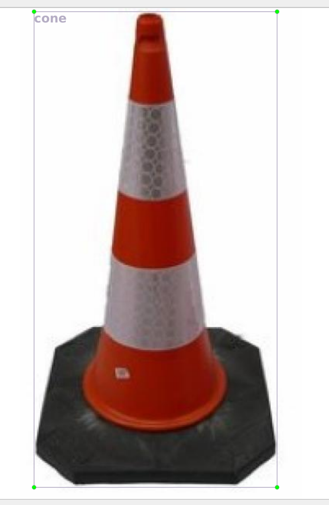

## 其他工程机械
equipment，除挖掘机和矿卡之外的其他工程机械，包括装载机、吊车、搅拌机、以及其他矿山中的作业机械。

示例图

 
示例↓

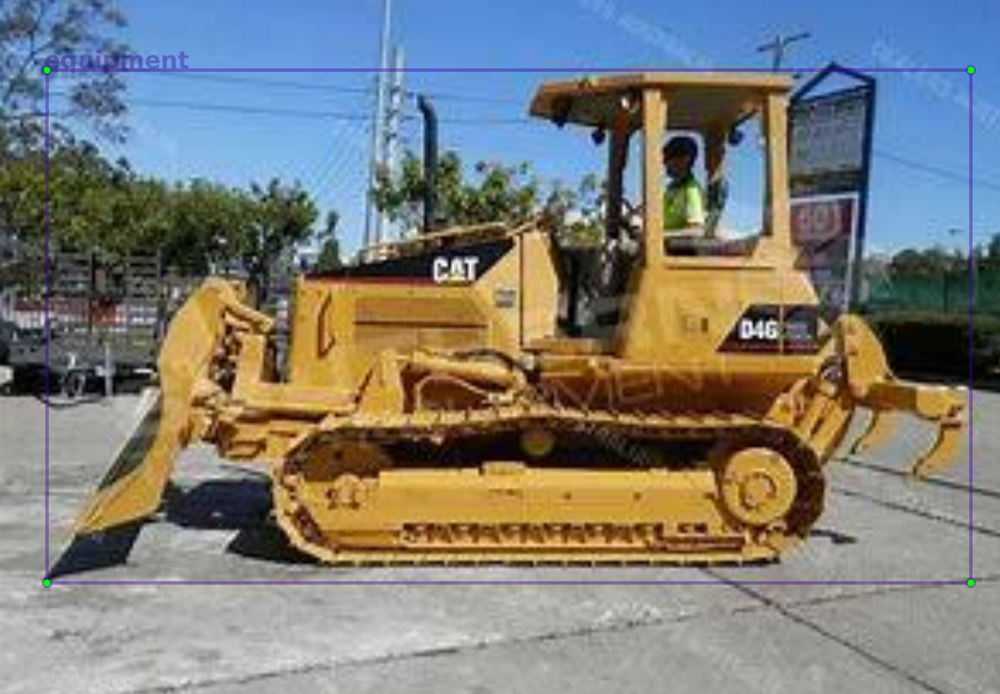
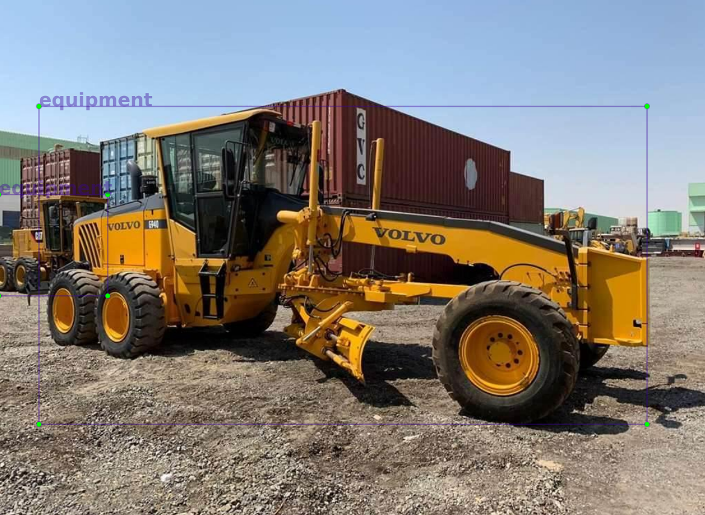
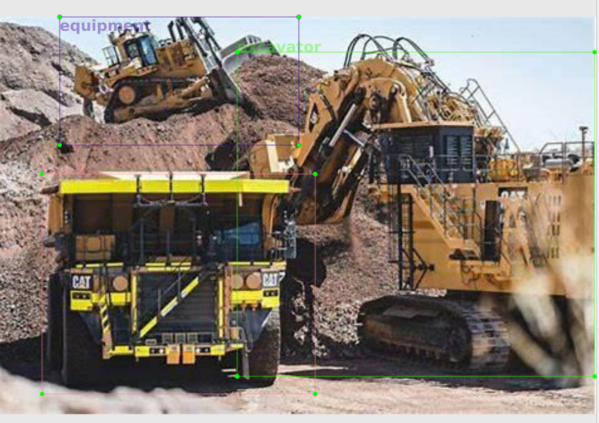

# 
难点图片📜

## 1)夜间标注问题

夜间标注，看不清车辆轮廓，仅有灯光闪耀，如何确定标注范围？

夜间光照标注难点示例图

 
示例↓

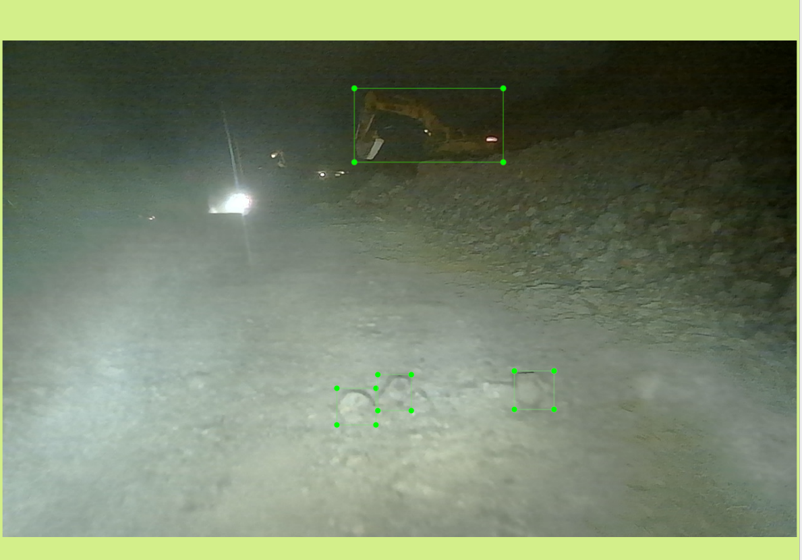

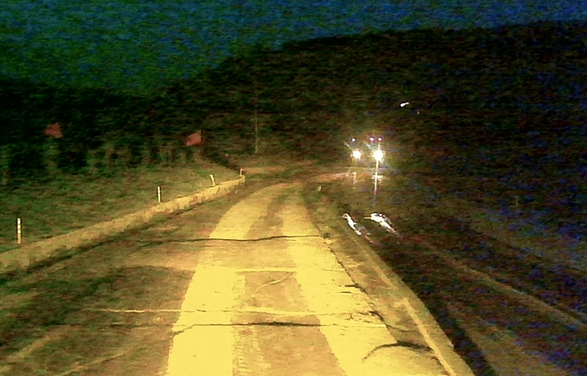

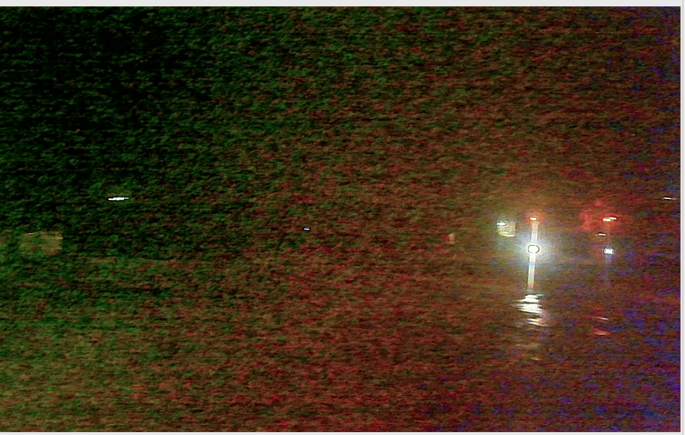

## 2) 石块问题

1、较多石块堆放一起，如何确定那些大小该标？

夜间光照标注难点示例图

 
示例↓

解答：

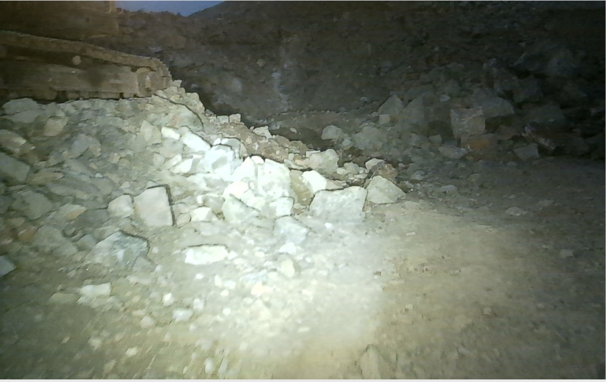

解答：

