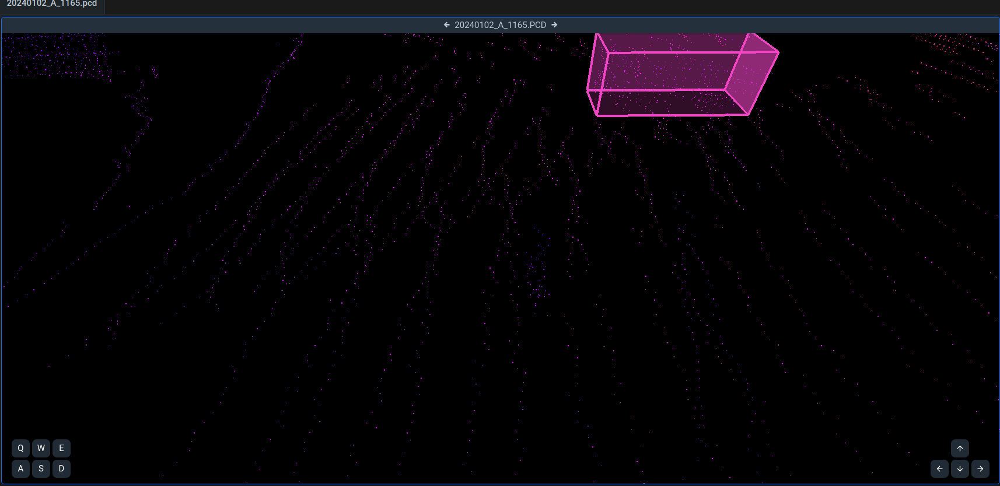

# <div align="center">⭐点云标准文档</div>
#### <p align = "center">马玉峰📜</p>
<div align="center">
<p>
🚚🚂🚌🚗前言🚜🚧🚲👨‍🔧
</p>
</div>

<div >
<details >
<summary align="left">AI任务的基石是数据集，数据集的基石是标准</summary>
基于深度学习的AI任务的基础是数据，可以说数据集的质量和数量在很大程度上决定了AI任务的上限。在图像分类领域，正是李飞飞创建的ImageNet数据集开启了视觉任务的深度学习时代，后续的COCO同样是目标检测领域持久的标杆。正是因为这些数据集在数据采集、清洗、标注上都建立了极为严格的标准，并且经过反复的审核，才能呈现极高的质量。

</details>
<br>

----
🚩 
                  
<details>
<summary>
场景分析⛰🏜
</summary>
工作场景为各类矿山。其中动态对象包括各类工程车辆（皮卡、挖掘机、装载机、矿车）、普通车辆、工作人员。静态目标包括方锥、路面、建筑物、碎石等。工作时间包括白天和夜间、正常天气与雨雪雾等恶劣天气。
</details>

<details>
<summary>
任务要求🎯🕹
</summary>
此项目主要目标是为了辅助矿车进行智能驾驶，目前的检测目标为以下十类。涵盖了矿车行驶过程中需避让的主要对象。

- 行人 (people)
- 矿车 (mining truck)
- 皮卡 (car)
- 轿车 (sedan)
- 半挂 (semi-trailer)
- 挖掘机 (excavator)
- 装载机 (loader)
- 洒水车 (watering car)
- 压路机 (road roller)
- 吊车 (truck crane)

</details>
🏁
</div>

----
<div>

# <div align="center">具体标注说明📜</div>


## 标注范围

### 距离
不管目标物体距离多远, 只要是可辨认出目标物体的都应该标注．

## 3D Box要求

3d box的大小，方向，类别都需要准确标注．对于旋转方向，需要将３个轴都旋转到正确的方向,最少要将yaw旋转到车头方向，行人需朝向人正前方。

### 各类车辆总体标注方法

3D box应该力求和真实目标物体大小一样，包括后视镜，车门(如果是开的)等所有附属物．box的方向是车头的方向，俯视图务必车头朝向前方（supervisely标注时上方白点指向前方），x轴（侧视图）、y轴（正视图）可暂时不要求方向，标注时俯视图上左右框线应与两侧车身线平行。
如有后视镜，应包含后视镜，如开车门，应包含车门。

注意区分车辆与地面，在侧视图与正视图中，车辆的下边缘应该与地面分隔，可通过左右两边的地面来估计地面位置。

<details align="left">
<summary>
车辆地面界限示意图
</summary>


</details>

对于部分遮挡的车，可以根据经验估计大小．或者通过前后帧查看较为清晰的车的3d box来估计本帧的大小和朝向。若是车辆被遮挡，box的大小应该是车辆的大小．

只有一个侧面清晰的对象，如能判断对象的具体类别，应根据对象的实际三维进行标注，如不能判断对象类别，可以不用标注。

#### 各类别车辆图片示例

<details align="left">
<summary>
皮卡
</summary>


</details>

<details align="left">
<summary>
矿车
</summary>


</details>

<details align="left">
<summary>
皮卡
</summary>


</details>

<details align="left">
<summary>
轿车
</summary>


</details>

<details align="left">
<summary>
半挂
</summary>


</details>

<details align="left">
<summary>
挖掘机
</summary>


</details>

<details align="left">
<summary>
装载机
</summary>


</details>

<details align="left">
<summary>
洒水车
</summary>


</details>

<details align="left">
<summary>
压路车
</summary>


</details>

<details align="left">
<summary>
吊车
</summary>


</details>

```shell
#对于存在遮挡但是类别明确的对象，使用参考下述属性来估计 box，在长宽高能确定其一时都可以根据比例来估计其他属性。
mining truck : 长 9.6米，宽3.83米，高4.3米
皮卡： 长5.26米，宽1.87米，高1.85米
行人： 人长宽约 0.8 * 0.6 ，高1.72米
```
---

### 行人
box应该包括整个人，包括四肢．人走动时形状发生变化，box应该跟着变化．
人方向为整个主体躯干的方向，或者行进的方向．（后续标注需根据人的方向调整yaw）




<!-- ## 示例


 -->

### 

#### train-21713
| 类别                      | 数量    |
|---------------------------|---------|
| 皮卡 (pickup)                | 3191    |
| 人 (people)               | 23321   |
| 矿车 (mining truck)       | 17633   |
| 挖掘机 (excavator)        | 2541    |
| 半挂车 (semi-trailer truck) | 579     |
| 轿车 (sedan)              | 121804  |
| 装载机 (loader)           | 48      |
| 中型卡车 (medium truck)   | 8553    |


#### val-1000
| 类别                      | 数量    |
|---------------------------|---------|
| 皮卡 (pickup)                | 151     |
| 人 (people)               | 991     |
| 矿车 (mining truck)       | 849     |
| 挖掘机 (excavator)        | 126     |
| 半挂车 (semi-trailer truck) | 20      |
| 轿车 (sedan)              | 5078    |
| 装载机 (loader)           | 5       |
| 中型卡车 (medium truck)   | 111     |
